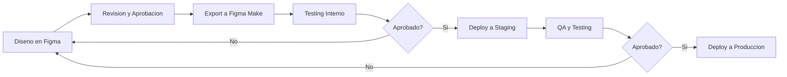
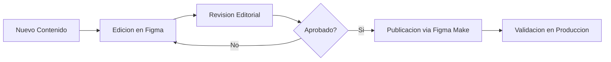

# Papelera del Pacífico - Sitio Web Corporativo


## Descripcion General

Sitio web corporativo para Papelera del Pacífico SPA, empresa chilena dedicada a la fabricacion y distribucion de productos de papel de alta calidad bajo la marca Maxifort.

### Caracteristicas Principales

- Catalogo completo de productos (Papel Toalla, Papel Higienico, Sabanilla Medica)
- Diseno responsive (Desktop, Tablet, Mobile)
- Sistema de diseno basado en identidad de marca Papelera del Pacífico
- Formulario de contacto integrado
- Informacion corporativa y valores
- Optimizacion SEO y accesibilidad WCAG AA

## Tabla de Contenidos

- [Stack Tecnologico](#stack-tecnologico)
- [Inicio Rapido](#inicio-rapido)
- [Estructura del Proyecto](#estructura-del-proyecto)
- [Documentacion](#documentacion)
- [Workflows](#workflows)
- [Contacto](#contacto)

## Stack Tecnologico

### Diseno y Desarrollo
- **Figma**: Herramienta principal de diseno
- **Figma Make**: Plataforma de desarrollo y deployment
- **Google Analytics**: Seguimiento y analitica
- **Google Maps API**: Integracion de mapas

### Sistema de Diseno
- **Colores**: Paleta corporativa Papelera del Pacífico (Azul Navy #1B4F72, Verde #7CB342, Cyan #00BCD4)
- **Tipografia**: Montserrat (titulos), Open Sans (cuerpo)
- **Grid System**: 12 columnas, 20px gutter
- **Breakpoints**: 1440px (Desktop), 768px (Tablet), 375px (Mobile)

## Inicio Rapido

### Prerequisitos

- Cuenta de Figma
- Acceso al archivo de diseno: "Papelera del Pacífico - Sitio Web"
- Acceso a Figma Make
- Permisos de publicacion

### Setup Inicial

1. **Acceder al Archivo de Figma**
   ```
   Archivo: Papelera del Pacífico - Sitio Web
   URL: [Pendiente agregar]
   ```

2. **Revisar Sistema de Diseno**
   - Navegar a la pagina "00_Design_System"
   - Familiarizarse con componentes, colores y estilos

3. **Explorar Estructura de Paginas**
   ```
   01_Home
   02_Nosotros
   03_Productos_Listado
   04_Productos_Detalle
   05_Contacto
   ```

4. **Configurar Figma Make**
   - Conectar archivo de Figma
   - Configurar dominio
   - Establecer configuraciones de SEO

## Estructura del Proyecto

```
ayd-web/
├── docs/                          # Documentacion tecnica
│   ├── ARCHITECTURE.md            # Arquitectura del sistema
│   ├── DESIGN_SYSTEM.md          # Sistema de diseno
│   ├── DEVELOPMENT_GUIDE.md      # Guia de desarrollo
│   ├── CONTENT_MANAGEMENT.md     # Gestion de contenido
│   ├── DEPLOYMENT.md             # Procesos de deployment
│   ├── INTEGRATIONS.md           # Documentacion de integraciones
│   └── MAINTENANCE.md            # Plan de mantenimiento
├── assets/                        # Assets del proyecto
│   ├── images/                   # Imagenes de productos
│   ├── logos/                    # Logos y marca
│   ├── icons/                    # Iconografia
│   └── lifestyle/                # Imagenes lifestyle
├── content/                       # Contenido editorial
│   ├── products/                 # Informacion de productos
│   └── pages/                    # Contenido de paginas
├── PRD-Papelera-AYD.md           # Product Requirements Document
└── README.md                      # Este archivo
```

## Documentacion

### Documentacion Disponible

1. **[Architecture](docs/ARCHITECTURE.md)** - Arquitectura tecnica del proyecto
   - Stack tecnologico completo
   - Estructura de archivos y carpetas
   - Flujo de desarrollo
   - Configuracion de environments

2. **[Design System](docs/DESIGN_SYSTEM.md)** - Sistema de diseno
   - Guia de componentes
   - Tokens de diseno (colores, tipografia, espaciados)
   - Patrones de UI reutilizables
   - Guia de uso para cada componente

3. **[Development Guide](docs/DEVELOPMENT_GUIDE.md)** - Guias de desarrollo
   - Setup inicial
   - Workflow con Figma Make
   - Convenciones de codigo
   - Best practices

4. **[Content Management](docs/CONTENT_MANAGEMENT.md)** - Gestion de contenido
   - Content management guidelines
   - Actualizacion de productos
   - Agregar nuevas paginas
   - Guia de estilo editorial

5. **[Deployment](docs/DEPLOYMENT.md)** - Deployment y publicacion
   - Proceso de publicacion
   - Checklist pre-lanzamiento
   - Rollback procedures
   - Troubleshooting comun

6. **[Integrations](docs/INTEGRATIONS.md)** - Integraciones externas
   - Google Analytics setup
   - Formulario de contacto
   - Google Maps
   - Servicios externos

7. **[Maintenance](docs/MAINTENANCE.md)** - Mantenimiento y soporte
   - Actualizaciones de contenido
   - Backups
   - Monitoring
   - Support procedures

## Workflows

### Workflow de Desarrollo



### Workflow de Contenido



## Comandos Principales

### Figma Make

```bash
# Sincronizar diseno desde Figma
figma-make sync

# Generar codigo desde diseno
figma-make generate

# Preview local
figma-make preview

# Deploy a staging
figma-make deploy --env staging

# Deploy a produccion
figma-make deploy --env production
```

## Informacion del Cliente

**Cliente:** Papelera del Pacífico SPA
**Marca:** Maxifort
**Direccion:** Guardia vieja 202, Providencia, Santiago, Chile
**Telefono:** [Pendiente]
**Email:** [Pendiente]

## Valores de Marca

- **Compromiso**: Con nuestros clientes y la comunidad
- **Desarrollo**: Innovacion constante
- **Calidad**: En todos nuestros procesos

## Lineas de Productos

### Papel Toalla
- Linea Hogar (L, XL, XXL)
- Linea Institucional (XXL, XXXL)
- Linea Premium (XL)

### Papel Higienico
- Premium Ultra Suavidad (XL, XXL)

### Sabanilla Medica
- Linea Medica Institucional

## Metricas de Exito

- Tiempo de carga < 3 segundos
- Tasa de rebote < 50%
- Al menos 3 solicitudes de contacto por semana
- 100% responsive en todos los dispositivos
- Accesibilidad WCAG 2.1 nivel AA

## Soporte y Contacto

### Equipo de Desarrollo
- **Agencia:** AgenciaDos
- **Proyecto:** Papelera del Pacífico Web
- **Fecha de Inicio:** Noviembre 2025

### Links Importantes

- **PRD Completo**: [PRD-Papelera-del-Pacifico.md](PRD-Papelera-del-Pacifico.md)
- **Archivo de Figma**: [Pendiente agregar]
- **Sitio Staging**: [Pendiente agregar]
- **Sitio Produccion**: [Pendiente agregar]

## Licencia

Proyecto privado - Papelera del Pacífico SPA. Todos los derechos reservados.

## Versionado

### Version 1.0.0 (Noviembre 2025)
- Lanzamiento inicial del sitio web
- 5 paginas principales
- Catalogo de 10 productos
- Sistema de contacto
- Integracion con Google Maps

---

**Documentacion generada por AgenciaDos para Papelera del Pacífico SPA**
