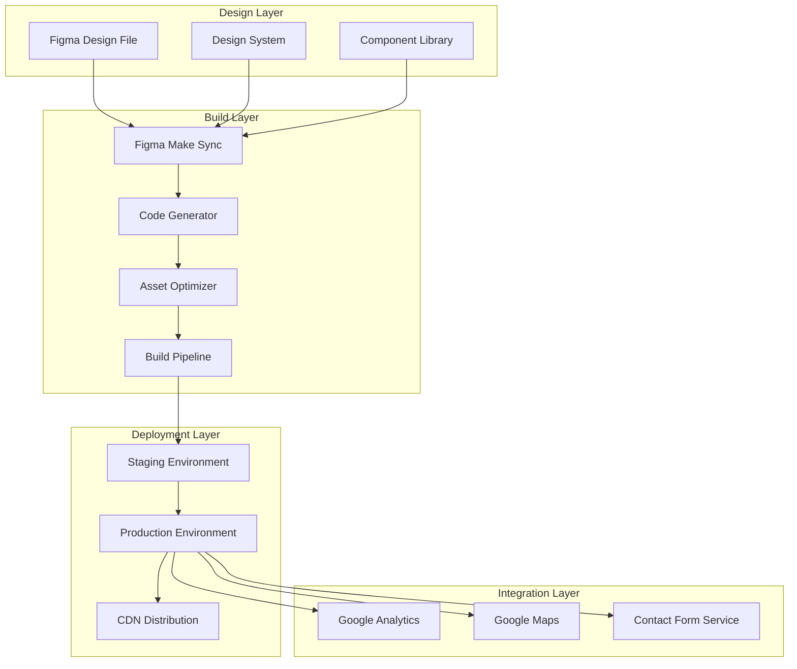
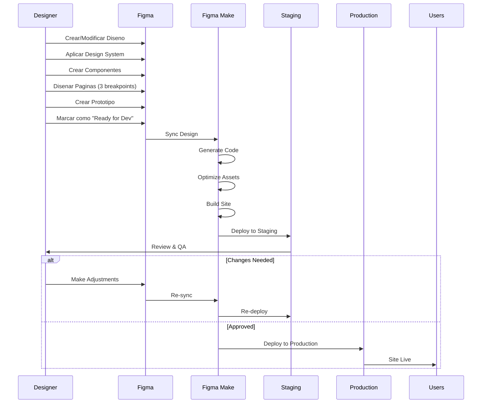

# Arquitectura del Proyecto - Papelera del Pacífico

## Tabla de Contenidos

- [Vision General](#vision-general)
- [Stack Tecnologico](#stack-tecnologico)
- [Arquitectura del Sistema](#arquitectura-del-sistema)
- [Estructura de Archivos](#estructura-de-archivos)
- [Flujo de Desarrollo](#flujo-de-desarrollo)
- [Environments](#environments)
- [Decisiones de Arquitectura](#decisiones-de-arquitectura)

## Vision General

El sitio web de Papelera del Pacífico es una aplicacion web corporativa construida utilizando Figma Make, una plataforma que permite convertir disenos de Figma directamente en sitios web funcionales sin necesidad de codificacion tradicional.

### Principios Arquitectonicos

1. **Design-First**: El diseno en Figma es la fuente de verdad
2. **Component-Based**: Arquitectura basada en componentes reutilizables
3. **Responsive by Default**: Diseno adaptativo en todos los dispositivos
4. **Performance-Oriented**: Optimizacion de carga y rendimiento
5. **Content-Manageable**: Facilidad de actualizacion de contenido

## Stack Tecnologico

### Capa de Diseno

```
┌─────────────────────────────────────┐
│           FIGMA                     │
│  - Sistema de Diseno                │
│  - Componentes UI                   │
│  - Paginas y Layouts                │
│  - Prototipos e Interacciones       │
└─────────────────────────────────────┘
```

**Herramientas:**
- **Figma**: Plataforma de diseno colaborativo
- **Plugins de Figma**:
  - Auto Layout
  - Content Reel (para contenido de prueba)
  - Unsplash (imagenes)
  - IconScout (iconografia)

### Capa de Desarrollo

```
┌─────────────────────────────────────┐
│         FIGMA MAKE                  │
│  - Code Generation                  │
│  - Build System                     │
│  - Asset Optimization               │
│  - Hosting & CDN                    │
└─────────────────────────────────────┘
```

**Caracteristicas de Figma Make:**
- Conversion automatica de Figma a codigo
- Sistema de build integrado
- Optimizacion de assets (imagenes, SVG)
- Hosting y CDN incluido
- SSL/TLS automatico
- Responsive handling

### Capa de Integracion

```
┌─────────────────────────────────────┐
│    SERVICIOS EXTERNOS               │
│  - Google Analytics                 │
│  - Google Maps API                  │
│  - Email Service (Formulario)       │
└─────────────────────────────────────┘
```

**Servicios Integrados:**
- **Google Analytics 4**: Seguimiento y metricas
- **Google Maps JavaScript API**: Mapa de ubicacion
- **Email Service**: Envio de formularios de contacto
- **Google Search Console**: SEO y indexacion

## Arquitectura del Sistema

### Diagrama de Arquitectura General



### Arquitectura de Componentes

```mermaid
graph TD
    subgraph "Global Components"
        A1[Header/Navigation]
        A2[Footer]
        A3[Buttons]
        A4[Category Badges]
    end

    subgraph "Product Components"
        B1[Product Card]
        B2[Product Gallery]
        B3[Specifications Table]
        B4[Product Filter]
    end

    subgraph "Content Components"
        C1[Hero Section]
        C2[Feature Cards]
        C3[CTA Sections]
        C4[Value Cards]
    end

    subgraph "Form Components"
        D1[Input Fields]
        D2[Textarea]
        D3[Select Dropdown]
        D4[Submit Button]
    end

    subgraph "Pages"
        E1[Home]
        E2[Nosotros]
        E3[Products Listing]
        E4[Product Detail]
        E5[Contact]
    end

    A1 --> E1
    A1 --> E2
    A1 --> E3
    A1 --> E4
    A1 --> E5

    A2 --> E1
    A2 --> E2
    A2 --> E3
    A2 --> E4
    A2 --> E5

    B1 --> E1
    B1 --> E3
    B2 --> E4
    B3 --> E4
    B4 --> E3

    C1 --> E1
    C2 --> E1
    C2 --> E2
    C3 --> E1
    C3 --> E5
    C4 --> E2

    D1 --> E5
    D2 --> E5
    D3 --> E5
    D4 --> E5
```



## Estructura de Archivos

### Organizacion del Proyecto

```
ayd-web/
│
├── README.md                          # Documentacion principal
├── PRD-Papelera-AYD.md               # Product Requirements Document
│
├── docs/                              # Documentacion tecnica
│   ├── ARCHITECTURE.md               # Este archivo
│   ├── DESIGN_SYSTEM.md              # Sistema de diseno
│   ├── DEVELOPMENT_GUIDE.md          # Guia de desarrollo
│   ├── CONTENT_MANAGEMENT.md         # Gestion de contenido
│   ├── DEPLOYMENT.md                 # Deployment
│   ├── INTEGRATIONS.md               # Integraciones
│   ├── MAINTENANCE.md                # Mantenimiento
│   └── ADR/                          # Architecture Decision Records
│       ├── 001-figma-make-selection.md
│       ├── 002-component-architecture.md
│       └── 003-responsive-strategy.md
│
├── assets/                            # Assets del proyecto
│   ├── images/                       # Imagenes generales
│   │   ├── products/                 # Imagenes de productos
│   │   │   ├── papel-toalla/
│   │   │   ├── papel-higienico/
│   │   │   └── sabanilla-medica/
│   │   └── lifestyle/                # Imagenes lifestyle
│   ├── logos/                        # Logos y marca
│   │   ├── ayd-horizontal.svg
│   │   ├── ayd-vertical.svg
│   │   ├── maxifort.svg
│   │   └── favicon/
│   ├── icons/                        # Iconografia
│   │   ├── social/
│   │   ├── products/
│   │   └── ui/
│   └── textures/                     # Texturas (papel rasgado, etc)
│
├── content/                           # Contenido editorial
│   ├── products/                     # Data de productos
│   │   ├── papel-toalla.json
│   │   ├── papel-higienico.json
│   │   └── sabanilla-medica.json
│   ├── pages/                        # Contenido de paginas
│   │   ├── home.md
│   │   ├── nosotros.md
│   │   └── contacto.md
│   └── seo/                          # Meta data SEO
│       ├── meta-tags.json
│       └── structured-data.json
│
├── figma/                             # Archivos de Figma
│   ├── design-system-tokens.json     # Tokens de diseno exportados
│   ├── component-specs.json          # Especificaciones de componentes
│   └── export-settings.json          # Configuracion de exportacion
│
└── config/                            # Configuraciones
    ├── figma-make-config.json        # Config de Figma Make
    ├── analytics-config.json         # Config de Analytics
    ├── seo-config.json               # Config SEO
    └── deployment-config.json        # Config de deployment
```

### Estructura en Figma

```
Papelera del Pacífico - Sitio Web (Figma File)
│
├── 📋 00_Documentation                # Documentacion del archivo
│   ├── Project Overview
│   ├── Design Specifications
│   └── Component Usage Guide
│
├── 🎨 00_Design_System               # Sistema de diseno
│   ├── Color Styles
│   ├── Text Styles
│   ├── Effect Styles
│   ├── Grid Styles
│   └── Spacing System
│
├── 🧩 00_Components                  # Biblioteca de componentes
│   ├── Navigation/
│   │   ├── Header - Desktop
│   │   ├── Header - Mobile
│   │   ├── Menu Overlay
│   │   └── Footer
│   ├── Buttons/
│   │   ├── Primary
│   │   ├── Secondary
│   │   └── Text Link
│   ├── Cards/
│   │   ├── Product Card
│   │   ├── Feature Card
│   │   └── Value Card
│   ├── Forms/
│   │   ├── Input Text
│   │   ├── Textarea
│   │   ├── Select
│   │   └── Checkbox
│   ├── Product/
│   │   ├── Badge Category
│   │   ├── Gallery
│   │   ├── Specs Table
│   │   └── Filter Sidebar
│   └── Sections/
│       ├── Hero
│       ├── CTA
│       └── Feature Grid
│
├── 📱 01_Home                        # Pagina de inicio
│   ├── Home_Desktop_1440
│   ├── Home_Tablet_768
│   └── Home_Mobile_375
│
├── 👥 02_Nosotros                    # Pagina Nosotros
│   ├── Nosotros_Desktop_1440
│   ├── Nosotros_Tablet_768
│   └── Nosotros_Mobile_375
│
├── 📦 03_Productos_Listado          # Listado de productos
│   ├── Products_Desktop_1440
│   ├── Products_Tablet_768
│   └── Products_Mobile_375
│
├── 🔍 04_Productos_Detalle          # Detalle de producto
│   ├── ProductDetail_Desktop_1440
│   ├── ProductDetail_Tablet_768
│   └── ProductDetail_Mobile_375
│
├── 📧 05_Contacto                   # Pagina de contacto
│   ├── Contact_Desktop_1440
│   ├── Contact_Tablet_768
│   └── Contact_Mobile_375
│
└── 🔗 06_Prototype                  # Prototipo interactivo
    └── Flow Connections
```

## Flujo de Desarrollo

### Workflow Completo



### Proceso de Diseno

1. **Planificacion**
   - Revisar PRD y requisitos
   - Definir estructura de paginas
   - Planificar componentes necesarios

2. **Setup del Sistema de Diseno**
   - Crear paleta de colores
   - Definir estilos de texto
   - Establecer espaciados y grid
   - Crear componentes base

3. **Diseno de Componentes**
   - Disenar variantes de componentes
   - Aplicar Auto Layout
   - Configurar constraints
   - Documentar uso

4. **Diseno de Paginas**
   - Disenar version desktop (1440px)
   - Adaptar a tablet (768px)
   - Adaptar a mobile (375px)
   - Verificar consistencia

5. **Prototipado**
   - Crear flujos de navegacion
   - Agregar interacciones
   - Definir hover states
   - Configurar overlays

### Proceso de Publicacion

1. **Preparacion en Figma**
   ```
   ✓ Verificar que todos los frames estan nombrados correctamente
   ✓ Confirmar que todos los componentes tienen variants adecuadas
   ✓ Validar que los textos estan en capas de texto (no outlines)
   ✓ Verificar que las imagenes estan optimizadas
   ✓ Confirmar que los links de prototipo funcionan
   ```

2. **Sincronizacion con Figma Make**
   ```bash
   # En Figma Make Dashboard
   1. Conectar archivo de Figma
   2. Seleccionar frames a publicar
   3. Configurar mapeo de paginas
   4. Establecer configuracion de SEO
   5. Ejecutar sincronizacion
   ```

3. **Build y Optimization**
   ```
   ✓ Figma Make genera codigo HTML/CSS
   ✓ Optimiza y comprime imagenes
   ✓ Genera assets responsive
   ✓ Aplica configuraciones de SEO
   ✓ Crea sitemap automatico
   ```

4. **Deploy a Staging**
   ```
   ✓ Deploy automatico a URL de staging
   ✓ Testing de funcionalidad
   ✓ Validacion de responsive
   ✓ Testing de formularios
   ✓ Revision de SEO
   ```

5. **Deploy a Produccion**
   ```
   ✓ Aprobacion de stakeholders
   ✓ Deploy a dominio de produccion
   ✓ Verificacion de DNS
   ✓ Activacion de SSL
   ✓ Smoke testing
   ```

## Environments

### Configuracion de Ambientes

| Environment | URL | Proposito | Deployment |
|-------------|-----|-----------|------------|
| **Development** | figma-local | Diseno y desarrollo activo en Figma | Manual |
| **Staging** | [staging-url].figma.site | Testing y validacion antes de produccion | Automatico desde Figma |
| **Production** | www.papeleraayd.cl (ejemplo) | Sitio publico | Manual con aprobacion |

### Staging Environment

**Proposito:**
- Testing de nuevas funcionalidades
- Revision de diseno por stakeholders
- QA antes de produccion
- Training y demos

**Caracteristicas:**
- URL temporal de Figma Make
- No indexado por motores de busqueda
- Sin analytics de produccion
- Puede ser protected con password

**Configuracion:**
```json
{
  "environment": "staging",
  "indexing": false,
  "analytics": {
    "enabled": false
  },
  "protection": {
    "password": true
  },
  "cache": {
    "enabled": false
  }
}
```

### Production Environment

**Proposito:**
- Sitio web publico oficial
- Acceso de usuarios finales
- Tracking de metricas reales

**Caracteristicas:**
- Dominio personalizado
- SSL/TLS habilitado
- Analytics activo
- CDN para optimizacion global
- Cache habilitado

**Configuracion:**
```json
{
  "environment": "production",
  "domain": "www.papeleraayd.cl",
  "ssl": true,
  "indexing": true,
  "analytics": {
    "enabled": true,
    "trackingId": "G-XXXXXXXXXX"
  },
  "cdn": {
    "enabled": true
  },
  "cache": {
    "enabled": true,
    "ttl": 3600
  }
}
```

## Decisiones de Arquitectura

### ADR 001: Seleccion de Figma Make

**Estado:** Aceptado

**Contexto:**
Necesidad de una plataforma que permita desarrollo rapido de sitio web corporativo sin requerir equipo de desarrollo full-stack.

**Decision:**
Utilizar Figma Make como plataforma de desarrollo y hosting.

**Razones:**
- Integracion nativa con Figma
- No requiere conocimientos de programacion
- Deployment automatico
- Hosting y CDN incluido
- Mantenimiento simplificado
- Actualizaciones rapidas de contenido

**Consecuencias:**
- Positivas:
  - Tiempo de desarrollo reducido
  - Menor costo de desarrollo
  - Facilidad de mantenimiento
  - Actualizaciones rapidas
- Negativas:
  - Limitaciones en funcionalidades complejas
  - Dependencia de plataforma third-party
  - Personalizacion limitada de codigo

**Alternativas Consideradas:**
- WordPress + tema personalizado
- Desarrollo custom con React/Next.js
- Webflow
- Builder.io

### ADR 002: Arquitectura de Componentes

**Estado:** Aceptado

**Contexto:**
Necesidad de mantener consistencia de diseno y facilitar actualizaciones.

**Decision:**
Implementar arquitectura basada en componentes con Design System centralizado.

**Razones:**
- Consistencia visual en todo el sitio
- Reutilizacion de componentes
- Facilidad de mantenimiento
- Escalabilidad
- Documentacion clara

**Consecuencias:**
- Positivas:
  - Diseno consistente
  - Desarrollo mas rapido
  - Cambios globales faciles
  - Mejor colaboracion
- Negativas:
  - Requiere planificacion inicial
  - Curva de aprendizaje del sistema

### ADR 003: Estrategia Responsive

**Estado:** Aceptado

**Contexto:**
Necesidad de soportar multiples dispositivos y tamaños de pantalla.

**Decision:**
Disenar tres breakpoints principales: Desktop (1440px), Tablet (768px), Mobile (375px).

**Razones:**
- Cobertura de dispositivos mas comunes
- Balance entre esfuerzo y cobertura
- Alineado con capacidades de Figma Make
- Estandares de industria

**Consecuencias:**
- Positivas:
  - Experiencia optima en dispositivos principales
  - Esfuerzo de diseno manejable
  - Testing simplificado
- Negativas:
  - Pantallas entre breakpoints pueden no ser optimas
  - Requiere disenar y mantener 3 versiones

## Consideraciones de Rendimiento

### Metricas Objetivo

| Metrica | Objetivo | Como Medirla |
|---------|----------|--------------|
| First Contentful Paint (FCP) | < 1.5s | Lighthouse |
| Largest Contentful Paint (LCP) | < 2.5s | Core Web Vitals |
| Time to Interactive (TTI) | < 3.0s | Lighthouse |
| Total Page Size | < 2MB | DevTools Network |
| Image Optimization | WebP format | Asset Analysis |

### Optimizaciones Implementadas

1. **Imagenes**
   - Formato WebP con fallback JPEG
   - Lazy loading en imagenes below-the-fold
   - Responsive images con srcset
   - Compresion automatica por Figma Make

2. **Assets**
   - SVG para logos e iconos
   - Sprites para iconografia multiple
   - Minificacion de CSS/JS
   - Compresion GZIP

3. **Caching**
   - Browser caching headers
   - CDN caching
   - Static asset caching
   - Service worker (si disponible)

4. **Code**
   - CSS critico inline
   - JavaScript diferido
   - Eliminacion de codigo no utilizado
   - Code splitting por pagina

## Seguridad

### Medidas de Seguridad

1. **Transporte Seguro**
   - SSL/TLS obligatorio (HTTPS)
   - HSTS headers
   - Secure cookies

2. **Proteccion de Formularios**
   - Validacion client-side
   - Validacion server-side
   - CSRF protection
   - Rate limiting
   - Captcha (si necesario)

3. **Headers de Seguridad**
   ```
   Content-Security-Policy
   X-Frame-Options: DENY
   X-Content-Type-Options: nosniff
   Referrer-Policy: strict-origin-when-cross-origin
   ```

4. **Privacy**
   - GDPR compliance
   - Cookie consent (si aplica)
   - Anonimizacion de IPs en Analytics
   - Privacy policy actualizada

## Escalabilidad

### Consideraciones de Escala

El sitio actual esta disenado para:
- **Trafico esperado**: 1,000 - 10,000 visitas/mes
- **Paginas**: 5 principales + paginas de detalle de producto
- **Productos**: ~10 productos (escalable a 50+)
- **Contenido**: Principalmente estatico con actualizaciones periodicas

### Plan de Escalamiento

Si el trafico aumenta significativamente:
1. Optimizar cache de CDN
2. Implementar imagen optimization avanzada
3. Considerar lazy loading mas agresivo
4. Evaluar upgrade de plan de Figma Make
5. Implementar analytics de performance detallado

## Monitoreo y Metricas

### Herramientas de Monitoreo

1. **Google Analytics 4**
   - Pageviews
   - User sessions
   - Bounce rate
   - Conversion tracking

2. **Google Search Console**
   - Search performance
   - Indexation status
   - Core Web Vitals
   - Mobile usability

3. **Uptime Monitoring**
   - Disponibilidad del sitio
   - Response times
   - Alertas de downtime

### KPIs Principales

| KPI | Objetivo | Frecuencia |
|-----|----------|------------|
| Uptime | > 99.5% | Continuo |
| Page Load Time | < 3s | Semanal |
| Bounce Rate | < 50% | Mensual |
| Contact Form Submissions | > 3/semana | Semanal |
| Mobile Traffic | > 40% | Mensual |

---

**Documento Mantenido por:** Equipo de Desarrollo AgenciaDos
**Ultima Actualizacion:** Noviembre 2025
**Version:** 1.0
