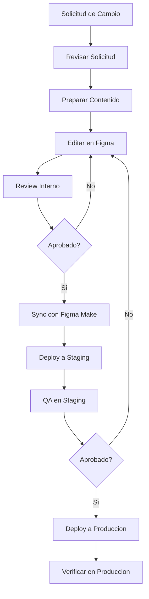

# Gestion de Contenido - Papelera del Pacífico

## Tabla de Contenidos

- [Introduccion](#introduccion)
- [Content Guidelines](#content-guidelines)
- [Gestion de Productos](#gestion-de-productos)
- [Gestion de Paginas](#gestion-de-paginas)
- [Gestion de Imagenes](#gestion-de-imagenes)
- [Guia de Estilo Editorial](#guia-de-estilo-editorial)
- [SEO y Metadata](#seo-y-metadata)
- [Workflow de Publicacion](#workflow-de-publicacion)

## Introduccion

Esta guia proporciona instrucciones detalladas para gestionar el contenido del sitio web de Papelera del Pacífico. Dado que el sitio esta construido con Figma Make, todas las actualizaciones de contenido se realizan editando el archivo de Figma.

### Principios de Contenido

1. **Claridad**: El contenido debe ser claro y facil de entender
2. **Consistencia**: Mantener un tono y estilo uniforme
3. **Precision**: Informacion tecnica exacta y actualizada
4. **Profesionalismo**: Reflejar los valores de la marca
5. **Accesibilidad**: Contenido comprensible para todos los usuarios

## Content Guidelines

### Tono de Voz

**Profesional pero Accesible**
- Serio sin ser rigido
- Tecnico sin ser complejo
- Confiable y cercano

**Ejemplo:**
```
✓ CORRECTO:
"Nuestro papel toalla Maxifort XL ofrece 100 metros de absorcion
superior, ideal para las necesidades de tu hogar."

✗ INCORRECTO:
"Compra ahora el mejor papel toalla del mercado!!! No te arrepentiras!!!"
```

### Estilo de Escritura

#### Uso de Pronombres

```
✓ Usar "tu" y "nuestro" para cercania
  "Tu familia merece la calidad de Maxifort"
  "Nuestros productos estan fabricados con 100% celulosa virgen"

✗ Evitar tercera persona distante
  "Los clientes encontraran productos de calidad"
```

#### Longitud de Oraciones

```
✓ Oraciones cortas y directas (15-20 palabras)
✓ Un concepto por oracion
✗ Oraciones largas y complejas
```

#### Estructura de Parrafos

```
✓ 2-4 oraciones por parafo
✓ Una idea principal por parafo
✓ Espacio entre parafos
```

### Mensajes Clave de Marca

Siempre reforzar:

1. **Compromiso**: Con clientes, comunidad y medio ambiente
2. **Calidad**: 100% celulosa virgen
3. **Innovacion**: Desarrollo constante
4. **Confiabilidad**: Marca establecida

## Gestion de Productos

### Anatomia de un Producto

Cada producto debe tener:

1. **Nombre del Producto**: Claro y descriptivo
2. **Categoria/Linea**: Badge visual
3. **Descripcion Breve**: 1-2 oraciones
4. **Imagen Principal**: Alta calidad, fondo transparente
5. **Especificaciones Tecnicas**: Completas y exactas
6. **Caracteristicas Destacadas**: 3-4 bullets
7. **CTA**: Call to action claro

### Template de Informacion de Producto

```markdown
NOMBRE DEL PRODUCTO
-------------------
[Nombre completo y descriptivo]

CATEGORIA
---------
[Papel Toalla / Papel Higienico / Sabanilla Medica]

LINEA
-----
[Hogar / Institucional / Premium / Medica]

COLOR DE LINEA
--------------
[Azul / Rojo / Verde / Amarillo]

DESCRIPCION BREVE
-----------------
[1-2 oraciones describiendo el producto y su uso principal]

CARACTERISTICAS DESTACADAS
---------------------------
- [Caracteristica 1]
- [Caracteristica 2]
- [Caracteristica 3]
- [Caracteristica 4]

ESPECIFICACIONES TECNICAS
--------------------------
Size: [Valor]
Metros: [Valor]
Hojas: [Valor si aplica]
Prepicado: [Si/No]
Fabricacion: [100% celulosa virgen]
Tipo de empaque: [Descripcion]
Para dispensadores: [Si/No - si aplica]
Pallet: [Valor]
Codigo: [Codigo interno]
Codigo de barra: [Codigo de barras]

USOS RECOMENDADOS
------------------
[Descripcion de casos de uso ideal]

IMAGENES
--------
- Imagen principal: [nombre-archivo.png]
- Imagenes secundarias: [si existen]
```

### Como Agregar un Nuevo Producto

#### Paso 1: Preparar Informacion

1. Completar template de informacion de producto
2. Recopilar imagenes de producto (ver Gestion de Imagenes)
3. Verificar especificaciones tecnicas con equipo de producto
4. Obtener aprobacion de informacion

#### Paso 2: Actualizar en Figma

1. **Duplicar Card de Producto Existente**
   - Ir a pagina "03_Productos_Listado"
   - Duplicar una product card existente (Ctrl/Cmd + D)
   - Renombrar layer: "product-card-[nombre-producto]"

2. **Actualizar Informacion**
   - Cambiar imagen del producto
   - Actualizar badge de categoria (seleccionar variante correcta)
   - Editar nombre del producto
   - Editar descripcion breve
   - Actualizar bullets de caracteristicas

3. **Crear Pagina de Detalle**
   - Ir a pagina "04_Productos_Detalle"
   - Duplicar frame existente
   - Renombrar: "ProductDetail_[NombreProducto]_Desktop_1440"
   - Actualizar toda la informacion:
     - Galeria de imagenes
     - Nombre y descripcion
     - Especificaciones tecnicas
     - Productos relacionados

4. **Repetir para Breakpoints**
   - Duplicar para Tablet (768px)
   - Duplicar para Mobile (375px)
   - Ajustar layouts segun responsive

5. **Conectar Prototipo**
   - Modo Prototype
   - Conectar boton "Ver detalles" de la card a la pagina de detalle
   - Configurar transicion

#### Paso 3: Sincronizar y Publicar

1. Guardar cambios en Figma
2. Sincronizar con Figma Make
3. Deploy a staging
4. Revisar producto en staging
5. Aprobacion
6. Deploy a produccion

### Como Actualizar un Producto Existente

#### Actualizar Informacion

1. Localizar el producto en Figma
2. Editar la informacion necesaria
3. Si es cambio en componente master, afectara todas las instancias
4. Si es cambio en instancia especifica, solo afecta esa instancia

#### Actualizar Imagen

1. Seleccionar frame de imagen
2. Click derecho > "Place image" o arrastra nueva imagen
3. Ajustar para que llene el frame apropiadamente
4. Verificar que se ve bien en los 3 breakpoints

#### Actualizar Especificaciones

1. Ir a tabla de especificaciones
2. Editar texto en cada celda
3. Mantener formato consistente
4. Verificar alineacion

### Como Eliminar un Producto

1. **En Listado de Productos**
   - Seleccionar product card
   - Eliminar (Delete/Backspace)
   - Ajustar grid si es necesario

2. **Pagina de Detalle**
   - Eliminar frames de detalle (Desktop, Tablet, Mobile)
   - Verificar que no haya links rotos en prototipo

3. **Productos Relacionados**
   - Buscar referencias en otras paginas de detalle
   - Eliminar o reemplazar con otro producto

4. **Sincronizar**
   - Sync con Figma Make
   - Verificar que producto ya no aparece
   - Deploy

## Gestion de Paginas

### Estructura de Paginas

Cada pagina principal tiene:

```
[Pagina]_Desktop_1440
[Pagina]_Tablet_768
[Pagina]_Mobile_375
```

### Como Actualizar Contenido de Pagina

#### Actualizar Textos

1. **Titulos (Headings)**
   ```
   - Seleccionar texto
   - Editar directamente
   - Verificar que usa Text Style correcto
   - No cambiar Text Style manualmente
   ```

2. **Texto de Parrafo**
   ```
   - Seleccionar texto
   - Editar contenido
   - Verificar que Text Style es "Body/Regular"
   - Mantener line height consistente
   ```

3. **Textos en Botones**
   ```
   - Doble click en boton
   - Editar texto
   - Auto Layout ajustara tamano automaticamente
   ```

#### Actualizar Imagenes de Seccion

1. Seleccionar imagen
2. Click derecho > "Place image"
3. Seleccionar nueva imagen
4. Ajustar para Fill container
5. Verificar responsive

#### Agregar Nueva Seccion

1. **Duplicar Seccion Existente Similar**
   ```
   - Seleccionar seccion completa (frame)
   - Ctrl/Cmd + D para duplicar
   - Mover a posicion correcta
   - Renombrar layer
   ```

2. **Actualizar Contenido**
   ```
   - Cambiar textos
   - Cambiar imagenes
   - Ajustar spacing si es necesario
   ```

3. **Verificar Responsive**
   ```
   - Replicar cambios en Tablet y Mobile
   - Ajustar layouts
   ```

### Paginas Especificas

#### Home

**Secciones:**
1. Hero Section
2. Sobre Nosotros (Resumen)
3. Desarrollo e Innovacion
4. Productos Destacados
5. CTA Final

**Frecuencia de Actualizacion:** Ocasional
**Contenido Clave:** Mensajes de marca, productos destacados

#### Nosotros

**Secciones:**
1. Banner
2. Quienes Somos
3. Nuestros Valores
4. Nuestra Ubicacion

**Frecuencia de Actualizacion:** Rara (solo cambios corporativos)
**Contenido Clave:** Informacion corporativa, valores, ubicacion

#### Productos

**Secciones:**
1. Header de Pagina
2. Filtros (Sidebar)
3. Grid de Productos

**Frecuencia de Actualizacion:** Frecuente (nuevos productos)
**Contenido Clave:** Catalogo de productos actualizado

#### Contacto

**Secciones:**
1. Banner
2. Formulario
3. Informacion de Contacto
4. Mapa

**Frecuencia de Actualizacion:** Rara (cambios de contacto)
**Contenido Clave:** Informacion de contacto actualizada

## Gestion de Imagenes

### Estandares de Imagenes

#### Imagenes de Producto

```
Formato: PNG con fondo transparente
Tamano: 800x800px minimo
Resolucion: 72-150 DPI
Peso: < 200KB (optimizado)
Aspect Ratio: 1:1 (cuadrado)
```

**Proceso:**
1. Fotografia profesional con fondo neutro
2. Remover fondo (Photoshop, remove.bg)
3. Redimensionar a 800x800px
4. Exportar como PNG
5. Optimizar con TinyPNG o ImageOptim
6. Nombrar: `producto-[nombre]-[variante].png`

**Ejemplo:**
```
papel-toalla-maxifort-xl-hogar.png
papel-higienico-premium-xxl.png
sabanilla-medica-pack-2.png
```

#### Imagenes Lifestyle

```
Formato: JPEG
Tamano: 1920x1080px (16:9) o 1600x1200px (4:3)
Resolucion: 72 DPI
Peso: < 300KB
```

**Proceso:**
1. Seleccionar imagen de alta calidad
2. Recortar a aspect ratio correcto
3. Redimensionar
4. Ajustar brillo/contraste
5. Exportar como JPEG (80-85% calidad)
6. Optimizar
7. Nombrar: `lifestyle-[descripcion].jpg`

**Ejemplo:**
```
lifestyle-familia-cocina.jpg
lifestyle-bano-moderno.jpg
lifestyle-oficina-dispensador.jpg
```

#### Logos e Iconos

```
Formato: SVG (preferido) o PNG @2x
Tamano: Variable segun uso
```

**Logos:**
```
ayd-logo-horizontal.svg
ayd-logo-vertical.svg
maxifort-logo.svg
```

**Iconos:**
```
Formato: SVG
Tamano: 24x24px, 32x32px, 48x48px
Color: Monochrome (negro), puede teñirse
```

### Workflow de Imagenes

#### Agregar Nueva Imagen

1. **Preparar Imagen**
   ```
   - Editar segun estandares
   - Optimizar peso
   - Nombrar apropiadamente
   ```

2. **Subir a Figma**
   ```
   - Arrastra imagen directamente a Figma
   - O File > Place Image
   - Colocar en frame correspondiente
   ```

3. **Configurar en Frame**
   ```
   - Ajustar para Fill container
   - Centrar si es necesario
   - Configurar para export
   ```

4. **Marcar para Export**
   ```
   - Seleccionar layer
   - Panel derecho > Export
   - Configurar formato y tamano
   - Figma Make tomara esto automaticamente
   ```

#### Reemplazar Imagen

1. Seleccionar frame con imagen
2. Click derecho > "Place image"
3. Seleccionar nueva imagen
4. Ajustar fit

#### Optimizar Imagenes Existentes

```
Periodicamente:
1. Auditar peso de imagenes
2. Optimizar las mas pesadas
3. Reemplazar versiones optimizadas
```

### Biblioteca de Imagenes

Mantener organizadas en carpeta del proyecto:

```
assets/
├── images/
│   ├── products/
│   │   ├── papel-toalla/
│   │   ├── papel-higienico/
│   │   └── sabanilla-medica/
│   ├── lifestyle/
│   │   ├── hogar/
│   │   ├── institucional/
│   │   └── medico/
│   ├── logos/
│   └── banners/
```

## Guia de Estilo Editorial

### Gramatica y Ortografia

#### Mayusculas

```
✓ Nombres propios: Papelera del Pacífico, Maxifort, Chile
✓ Titulos: Solo primera letra (sentence case)
  "Productos de papel de alta calidad"
✗ NO titulos todo en mayusculas
  "PRODUCTOS DE PAPEL DE ALTA CALIDAD"
```

#### Numeros

```
✓ Escribir numeros del 0-10 en letras: "tres productos"
✓ Usar digitos para 11+: "15 productos"
✓ Siempre digitos para especificaciones: "100 metros", "250 hojas"
```

#### Puntuacion

```
✓ Un espacio despues de punto, coma
✓ Sin espacio antes de punto, coma
✓ Sin puntos en titulos
✓ Puntos al final de parrafos completos
```

### Terminologia de Producto

**Estandares:**

```
Producto: Papel Toalla (no "Papel Toalla" ni "papel toalla")
Marca: Maxifort
Empresa: Papelera del Pacífico SPA
Material: 100% celulosa virgen
Categorias:
  - Papel Toalla
  - Papel Higienico (con acento)
  - Sabanilla Medica (con acento)

Lineas:
  - Hogar
  - Institucional
  - Premium
  - Medica (con acento)

Tamanos: L, XL, XXL, XXXL (siempre en mayusculas)
```

### Descripciones de Producto

**Template:**

```
[Producto] Maxifort [Tamano] [Linea] ofrece [caracteristica principal],
ideal para [uso principal]. Fabricado con 100% celulosa virgen,
garantiza [beneficio secundario].
```

**Ejemplo:**
```
Papel Toalla Maxifort XL Hogar ofrece 100 metros de absorcion superior,
ideal para las necesidades diarias de tu hogar. Fabricado con 100%
celulosa virgen, garantiza maxima resistencia y suavidad.
```

### Llamados a la Accion (CTAs)

**Efectivos:**
```
✓ "Ver detalles"
✓ "Conocer mas"
✓ "Contactanos"
✓ "Solicitar informacion"
✓ "Explorar productos"
```

**Evitar:**
```
✗ "Click aqui"
✗ "Mas informacion"
✗ "Leer mas"
```

## SEO y Metadata

### Titulos de Pagina (Title Tags)

**Formato:**
```
[Titulo de Pagina] | Papelera del Pacífico
```

**Ejemplos:**
```
Home: "Papelera del Pacífico - Productos de Papel de Calidad | Marca Maxifort"
Productos: "Catalogo de Productos | Papelera del Pacífico"
Producto: "Papel Toalla Maxifort XL Hogar | Papelera del Pacífico"
Nosotros: "Quienes Somos | Papelera del Pacífico"
Contacto: "Contacto | Papelera del Pacífico"
```

**Reglas:**
```
Longitud: 50-60 caracteres (max 70)
Incluir keywords principales
Incluir marca
Unico por pagina
```

### Meta Descriptions

**Formato:**
```
Descripcion clara y concisa de 150-160 caracteres que incluya
keyword principal y call to action.
```

**Ejemplos:**

**Home:**
```
"Papelera del Pacífico SPA fabrica productos de papel de alta calidad bajo la
marca Maxifort: papel toalla, papel higienico y sabanilla medica.
Compromiso, desarrollo e innovacion."
```

**Productos:**
```
"Catalogo completo de productos Maxifort: papel toalla para hogar e
institucional, papel higienico premium y sabanilla medica. 100%
celulosa virgen."
```

**Producto Individual:**
```
"Papel Toalla Maxifort XL Hogar: 100 metros de absorcion superior.
Fabricado con 100% celulosa virgen. Ideal para tu hogar. Conoce
especificaciones."
```

### Keywords

**Keywords Principales:**
```
- papel toalla
- papel higienico
- sabanilla medica
- maxifort
- papelera ayd
- celulosa virgen
- productos de papel
- papel institucional
- papel premium
```

**Keywords por Pagina:**

**Home:**
```
papelera ayd, maxifort, productos de papel, papel toalla chile,
papel higienico chile
```

**Productos:**
```
catalogo papel toalla, papel higienico premium, sabanilla medica,
productos maxifort, papel institucional
```

**Producto:**
```
[nombre producto], papel toalla [tamano], papel [linea], maxifort [tipo]
```

### URLs Amigables

**Estructura:**
```
Home: /
Nosotros: /nosotros
Productos: /productos
Producto: /productos/[slug]
Contacto: /contacto
```

**Slugs de Producto:**
```
/productos/papel-toalla-maxifort-xl-hogar
/productos/papel-higienico-premium-xxl
/productos/sabanilla-medica-pack-2
```

**Reglas:**
```
✓ Todo en minusculas
✓ Separar palabras con guion (-)
✓ Sin acentos ni caracteres especiales
✓ Descriptivo y conciso
✓ Incluir keywords
```

### Alt Text para Imagenes

**Formato:**
```
Descripcion clara y concisa de la imagen, incluyendo contexto
relevante y keywords cuando sea natural.
```

**Ejemplos:**

**Productos:**
```
"Papel Toalla Maxifort XL Hogar 100 metros"
"Papel Higienico Premium Ultra Suavidad XXL paquete de 6 rollos"
"Sabanilla Medica Maxifort pack de 2 rollos"
```

**Lifestyle:**
```
"Familia usando Papel Toalla Maxifort en cocina moderna"
"Dispensador de papel toalla institucional Maxifort en oficina"
"Papel higienico premium Maxifort en bano contemporaneo"
```

**Logos e Iconos:**
```
"Logo Papelera del Pacífico"
"Icono papel toalla"
"Icono sabanilla medica"
```

**Decorativas:**
```
alt="" (dejar vacio si es puramente decorativa)
```

## Workflow de Publicacion

### Proceso de Actualizacion de Contenido



### Checklist Pre-Publicacion

#### Contenido

- [ ] Ortografia y gramatica verificadas
- [ ] Tono de voz consistente con marca
- [ ] Terminologia estandar utilizada
- [ ] Links funcionan correctamente
- [ ] Informacion tecnica exacta

#### Imagenes

- [ ] Imagenes optimizadas (peso)
- [ ] Formatos correctos (PNG/JPG/SVG)
- [ ] Alt text agregado
- [ ] Imagenes se ven bien en 3 breakpoints

#### SEO

- [ ] Title tags configurados
- [ ] Meta descriptions agregadas
- [ ] Keywords relevantes incluidas
- [ ] URLs amigables

#### Responsive

- [ ] Contenido legible en mobile
- [ ] Imagenes se adaptan correctamente
- [ ] Botones y links son clickables
- [ ] No hay texto cortado

#### Accesibilidad

- [ ] Contraste de texto adecuado
- [ ] Headings jerarquizados correctamente
- [ ] Alt text en imagenes
- [ ] Textos legibles (tamano minimo)

### Roles y Responsabilidades

#### Content Manager

```
Responsabilidades:
- Solicitar cambios de contenido
- Proveer contenido actualizado
- Revisar contenido publicado
- Aprobar antes de produccion
```

#### Designer

```
Responsabilidades:
- Actualizar contenido en Figma
- Mantener design system
- Verificar consistencia visual
- Preparar assets
```

#### QA

```
Responsabilidades:
- Revisar en staging
- Verificar responsive
- Testear funcionalidad
- Aprobar para produccion
```

#### Tech Lead

```
Responsabilidades:
- Sincronizar Figma Make
- Deploy a staging/produccion
- Resolver issues tecnicos
- Monitorear performance
```

### Calendario de Actualizaciones

#### Actualizaciones Regulares

```
Semanal:
- Revisar metricas de contenido
- Verificar feedback de usuarios

Mensual:
- Actualizar productos si hay cambios
- Revisar informacion de contacto
- Optimizar contenido basado en analytics

Trimestral:
- Audit completo de contenido
- Actualizar imagenes si es necesario
- Revisar SEO performance
```

#### Actualizaciones Ad-Hoc

```
Cuando sea necesario:
- Nuevos productos
- Cambios de precios/especificaciones
- Actualizaciones corporativas
- Correcciones de errores
```

---

**Documento Mantenido por:** Equipo de Contenido AgenciaDos
**Ultima Actualizacion:** Noviembre 2025
**Version:** 1.0
