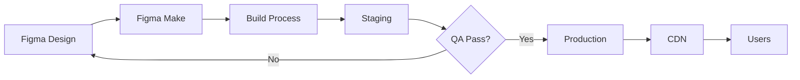

# Deployment - Papelera del Pacífico

## Tabla de Contenidos

- [Introduccion](#introduccion)
- [Environments](#environments)
- [Proceso de Deployment](#proceso-de-deployment)
- [Checklist Pre-Lanzamiento](#checklist-pre-lanzamiento)
- [Proceso de Rollback](#proceso-de-rollback)
- [Troubleshooting](#troubleshooting)
- [Monitoreo Post-Deployment](#monitoreo-post-deployment)

## Introduccion

Esta guia proporciona instrucciones detalladas para el deployment del sitio web de Papelera del Pacífico desde Figma Make a los diferentes ambientes (staging y produccion).

### Arquitectura de Deployment



## Environments

### Staging Environment

**Proposito:** Testing y validacion antes de produccion

**Caracteristicas:**
```
URL: [staging-url].figma.site
Indexing: Disabled (noindex, nofollow)
Analytics: Disabled o separado
Password Protection: Optional
SSL: Enabled
Cache: Disabled para testing
```

**Configuracion:**
```json
{
  "environment": "staging",
  "domain": "[staging-url].figma.site",
  "ssl": true,
  "seo": {
    "indexing": false,
    "robots": "noindex, nofollow"
  },
  "analytics": {
    "enabled": false
  },
  "cache": {
    "enabled": false
  },
  "passwordProtection": {
    "enabled": true,
    "password": "[staging-password]"
  }
}
```

**Acceso:**
```
URL: https://[staging-url].figma.site
Usuario: [Si tiene password protection]
Password: [staging-password]
```

### Production Environment

**Proposito:** Sitio web publico oficial

**Caracteristicas:**
```
URL: www.papeleraayd.cl (ejemplo)
Domain: Custom domain
Indexing: Enabled
Analytics: Google Analytics 4 activo
Password Protection: None
SSL: Enabled (forzado)
Cache: Enabled (CDN)
```

**Configuracion:**
```json
{
  "environment": "production",
  "domain": "www.papeleraayd.cl",
  "ssl": {
    "enabled": true,
    "forceHttps": true
  },
  "seo": {
    "indexing": true,
    "robots": "index, follow",
    "sitemap": "/sitemap.xml"
  },
  "analytics": {
    "enabled": true,
    "googleAnalytics": {
      "trackingId": "G-XXXXXXXXXX"
    }
  },
  "cache": {
    "enabled": true,
    "ttl": 3600,
    "cdn": true
  }
}
```

## Proceso de Deployment

### Pre-Deployment Preparation

#### 1. Verificar Cambios en Figma

```
Checklist:
[ ] Todos los frames estan nombrados correctamente
[ ] Design system aplicado consistentemente
[ ] Componentes funcionan correctamente
[ ] Textos revisados (ortografia, gramatica)
[ ] Imagenes optimizadas
[ ] Prototipo funciona
[ ] Responsive verificado en 3 breakpoints
[ ] Accesibilidad validada
[ ] Links funcionan correctamente
```

#### 2. Documentar Cambios

Crear log de cambios:

```markdown
# Deployment Log - [Fecha]

## Cambios Implementados
- [Descripcion de cambio 1]
- [Descripcion de cambio 2]
- [Descripcion de cambio 3]

## Paginas Afectadas
- [Pagina 1]
- [Pagina 2]

## Componentes Nuevos/Modificados
- [Componente 1]
- [Componente 2]

## Assets Nuevos
- [Asset 1]
- [Asset 2]

## Notas Especiales
[Cualquier consideracion especial]
```

#### 3. Backup del Estado Actual

Si es update a produccion existente:

```
1. Tomar screenshots del sitio actual
2. Documentar configuracion actual
3. Exportar configuraciones de Figma Make
4. Guardar version de Figma actual
```

### Deployment a Staging

#### Paso 1: Sincronizar desde Figma

1. **Acceder a Figma Make Dashboard**
   ```
   URL: [figma-make-dashboard-url]
   Login con credenciales
   Seleccionar proyecto "Papelera del Pacífico"
   ```

2. **Iniciar Sincronizacion**
   ```
   Click en "Sync from Figma"
   Seleccionar archivo de Figma
   Confirmar frames a sincronizar
   ```

3. **Revisar Cambios Detectados**
   ```
   Figma Make mostrara:
   - Frames nuevos
   - Frames modificados
   - Frames eliminados
   - Assets nuevos/modificados
   ```

4. **Confirmar Sincronizacion**
   ```
   Revisar cambios
   Click "Confirm Sync"
   Esperar finalizacion (1-5 minutos)
   ```

#### Paso 2: Build

El proceso de build es automatico:

```
1. Code Generation
   - HTML generado desde frames
   - CSS generado desde estilos
   - Responsive breakpoints configurados

2. Asset Optimization
   - Imagenes comprimidas
   - Formatos optimizados (WebP con fallback)
   - SVG optimizados

3. SEO Preparation
   - Meta tags generados
   - Sitemap creado
   - Structured data agregado

4. Performance Optimization
   - CSS minificado
   - HTML minificado
   - Assets optimizados
```

#### Paso 3: Deploy a Staging

1. **Iniciar Deploy**
   ```
   Click "Deploy to Staging"
   Confirmar deployment
   ```

2. **Esperar Deployment**
   ```
   Tiempo estimado: 2-5 minutos
   Monitorear progreso en dashboard
   ```

3. **Verificar Deployment**
   ```
   URL de staging disponible
   Click para abrir sitio
   ```

#### Paso 4: QA en Staging

Ver [Checklist Pre-Lanzamiento](#checklist-pre-lanzamiento) completo.

**Testing Basico:**
```
1. Verificar Home page carga correctamente
2. Navegar a todas las paginas principales
3. Verificar responsive (Mobile, Tablet, Desktop)
4. Testear formulario de contacto
5. Verificar imagenes cargan correctamente
6. Testear prototipo/interacciones
7. Verificar no hay errores de consola
```

**Testing Avanzado:**
```
1. Verificar performance (Lighthouse)
2. Validar accesibilidad (WAVE, axe)
3. Testear SEO (meta tags, structured data)
4. Cross-browser testing (Chrome, Firefox, Safari, Edge)
5. Testear en dispositivos reales
```

### Deployment a Produccion

#### Prerequisitos

```
[ ] Staging completamente testeado y aprobado
[ ] Stakeholders han aprobado
[ ] Backup del sitio actual realizado (si aplica)
[ ] Dominio configurado y verificado
[ ] SSL configurado
[ ] DNS actualizado (si nuevo dominio)
```

#### Paso 1: Final Review

1. **Review de Contenido**
   ```
   [ ] Todo el contenido es final
   [ ] No hay placeholders
   [ ] Informacion de contacto correcta
   [ ] Links externos funcionan
   ```

2. **Review Tecnico**
   ```
   [ ] Performance aceptable
   [ ] Accesibilidad validada
   [ ] SEO configurado
   [ ] Analytics configurado
   ```

3. **Review Legal**
   ```
   [ ] Privacy policy actualizada (si aplica)
   [ ] Terms of service (si aplica)
   [ ] Copyright correcto
   ```

#### Paso 2: Configuracion de Produccion

1. **Configurar Dominio**
   ```
   En Figma Make:
   - Settings > Domain
   - Agregar dominio custom: www.papeleraayd.cl
   - Seguir instrucciones de DNS
   - Verificar dominio
   ```

2. **Configurar DNS**
   ```
   En registrador de dominio:
   A Record:
   Name: @
   Value: [IP de Figma Make]

   CNAME Record:
   Name: www
   Value: [CNAME de Figma Make]
   ```

3. **Habilitar SSL**
   ```
   En Figma Make:
   - Settings > SSL
   - Enable SSL
   - Force HTTPS: Yes
   - Esperar emision de certificado (5-30 min)
   ```

4. **Configurar Analytics**
   ```
   En Figma Make:
   - Settings > Integrations
   - Google Analytics
   - Agregar Tracking ID: G-XXXXXXXXXX
   - Save
   ```

#### Paso 3: Deploy

1. **Iniciar Deployment**
   ```
   En Figma Make Dashboard:
   - Click "Deploy to Production"
   - Confirmar deployment
   - Agregar deployment notes
   ```

2. **Monitorear Deployment**
   ```
   - Ver progreso en dashboard
   - Tiempo estimado: 5-10 minutos
   - No cerrar navegador durante proceso
   ```

3. **Deployment Completo**
   ```
   - Confirmacion de deployment exitoso
   - URL de produccion disponible
   ```

#### Paso 4: Verificacion Post-Deployment

**Verificacion Inmediata:**
```
[ ] Sitio carga en URL de produccion
[ ] HTTPS funciona (candado verde)
[ ] Todas las paginas accesibles
[ ] Imagenes cargan correctamente
[ ] Formularios funcionan
[ ] No hay errores de consola
[ ] Analytics esta trackeando
```

**Verificacion Completa:**
```
[ ] Responsive funciona en todos los breakpoints
[ ] Cross-browser testing
[ ] Performance aceptable
[ ] SEO configurado correctamente
[ ] Sitemap accesible (/sitemap.xml)
[ ] Robots.txt configurado
```

## Checklist Pre-Lanzamiento

### Contenido

#### Textos
```
[ ] Ortografia y gramatica verificadas
[ ] No hay placeholders (Lorem ipsum, etc)
[ ] Informacion de contacto actualizada
[ ] Telefonos y emails correctos
[ ] Direccion correcta
[ ] Horarios de atencion actualizados
[ ] Todos los productos tienen informacion completa
[ ] Descripciones son precisas
[ ] Links internos funcionan
[ ] Links externos funcionan y abren en nueva pestana
```

#### Imagenes
```
[ ] Todas las imagenes cargan
[ ] Imagenes optimizadas (peso aceptable)
[ ] Alt text en todas las imagenes
[ ] Imagenes de producto de alta calidad
[ ] No hay imagenes rotas
[ ] Favicon configurado
[ ] Open Graph images configuradas
```

### Diseno y UX

#### Visual
```
[ ] Design system aplicado consistentemente
[ ] Colores corporativos correctos
[ ] Tipografia consistente
[ ] Espaciado uniforme
[ ] Alineacion correcta
[ ] No hay elementos cortados o sobrepuestos
```

#### Responsive
```
[ ] Desktop (1440px) se ve perfecto
[ ] Tablet (768px) se ve perfecto
[ ] Mobile (375px) se ve perfecto
[ ] Probado en pantallas mas grandes (1920px+)
[ ] Probado en pantallas mas pequenas (320px)
[ ] Imagenes se adaptan correctamente
[ ] Textos legibles en todos los tamanos
[ ] Botones suficientemente grandes en mobile (44px min)
```

#### Navegacion
```
[ ] Menu funciona correctamente
[ ] Menu mobile (hamburger) funciona
[ ] Breadcrumbs (si aplica)
[ ] Footer con todos los links
[ ] Navegacion intuitiva
[ ] Usuario puede llegar a cualquier pagina facilmente
```

### Funcionalidad

#### Interacciones
```
[ ] Todos los botones funcionan
[ ] Hover states funcionan
[ ] Active states funcionan
[ ] Transiciones suaves
[ ] Animaciones apropiadas (no invasivas)
[ ] Clicks/taps responden rapidamente
```

#### Formularios
```
[ ] Formulario de contacto funciona
[ ] Validacion de campos funciona
[ ] Mensajes de error claros
[ ] Mensaje de exito se muestra
[ ] Emails se envian correctamente
[ ] Campos requeridos marcados
[ ] Placeholders claros
```

#### Integraciones
```
[ ] Google Analytics configurado y trackeando
[ ] Google Maps funciona (si aplica)
[ ] Redes sociales linkeadas correctamente
[ ] Formulario envia a email correcto
```

### Performance

#### Velocidad
```
[ ] Tiempo de carga < 3 segundos
[ ] First Contentful Paint < 1.5s
[ ] Largest Contentful Paint < 2.5s
[ ] No hay recursos bloqueando render
[ ] Imagenes con lazy loading
```

#### Optimization
```
[ ] Imagenes optimizadas (WebP con fallback)
[ ] CSS minificado
[ ] JavaScript minificado
[ ] Cache configurado
[ ] CDN habilitado
```

#### Lighthouse Score
```
[ ] Performance > 90
[ ] Accessibility > 90
[ ] Best Practices > 90
[ ] SEO > 90
```

### SEO

#### On-Page SEO
```
[ ] Title tags configurados (todas las paginas)
[ ] Meta descriptions configuradas
[ ] Headings jerarquizados correctamente (H1, H2, H3)
[ ] URLs amigables
[ ] Alt text en imagenes
[ ] Structured data implementado
```

#### Technical SEO
```
[ ] Sitemap.xml generado y accesible
[ ] Robots.txt configurado
[ ] SSL habilitado (HTTPS)
[ ] Canonical URLs configurados
[ ] No hay contenido duplicado
[ ] 404 page configurada (si aplica)
```

#### Indexing
```
[ ] Sitio NO esta bloqueado para indexacion (produccion)
[ ] Google Search Console configurado
[ ] Sitio enviado para indexacion
```

### Accesibilidad

#### WCAG 2.1 AA
```
[ ] Contraste de texto adecuado (4.5:1 minimo)
[ ] Navegacion por teclado funciona
[ ] Focus states visibles
[ ] Labels en formularios
[ ] Alt text en imagenes
[ ] Headings jerarquicos
[ ] Links descriptivos (no "click aqui")
```

#### Testing
```
[ ] WAVE test pasado sin errores criticos
[ ] axe DevTools sin errores criticos
[ ] Keyboard navigation testeada
[ ] Screen reader compatible (basico)
```

### Seguridad

#### SSL/TLS
```
[ ] SSL habilitado
[ ] HTTPS forzado
[ ] Certificado valido
[ ] No hay mixed content warnings
```

#### Headers
```
[ ] Content-Security-Policy configurado
[ ] X-Frame-Options configurado
[ ] X-Content-Type-Options configurado
```

#### Forms
```
[ ] Validacion server-side
[ ] CSRF protection
[ ] Rate limiting (anti-spam)
```

### Legal y Compliance

#### Politicas
```
[ ] Privacy Policy actualizada (si aplica)
[ ] Terms of Service (si aplica)
[ ] Cookie Policy (si aplica)
[ ] Copyright notice actualizado
```

### Cross-Browser Testing

#### Desktop Browsers
```
[ ] Chrome (ultima version)
[ ] Firefox (ultima version)
[ ] Safari (ultima version)
[ ] Edge (ultima version)
```

#### Mobile Browsers
```
[ ] Chrome Mobile (Android)
[ ] Safari Mobile (iOS)
[ ] Samsung Internet (Android)
```

### Dispositivos Reales

#### Mobile
```
[ ] iPhone (Safari)
[ ] Android (Chrome)
```

#### Tablet
```
[ ] iPad (Safari)
[ ] Android Tablet
```

### Analytics y Tracking

#### Google Analytics
```
[ ] Tracking ID configurado
[ ] Pageviews trackeando
[ ] Events configurados (si aplica)
[ ] Goals configurados (formulario de contacto)
```

#### Search Console
```
[ ] Propiedad verificada
[ ] Sitemap enviado
[ ] Coverage sin errores
```

### Backup y Contingencia

#### Pre-Launch
```
[ ] Backup de version actual (si es update)
[ ] Screenshots de estado actual
[ ] Configuraciones documentadas
[ ] Plan de rollback preparado
```

## Proceso de Rollback

### Cuando Hacer Rollback

Hacer rollback inmediatamente si:
```
- Sitio no carga o tiene errores criticos
- Funcionalidad principal rota (formularios, navegacion)
- Performance drasticamente degradada
- Problemas de seguridad identificados
- Contenido incorrecto o inapropiado publicado
```

### Rollback en Figma Make

#### Metodo 1: Revertir a Version Anterior

1. **Acceder a Version History**
   ```
   Figma Make Dashboard
   > Project Settings
   > Version History
   ```

2. **Seleccionar Version Anterior**
   ```
   - Ver lista de deployments previos
   - Seleccionar version estable anterior
   - Ver detalles de esa version
   ```

3. **Rollback**
   ```
   - Click "Rollback to this version"
   - Confirmar rollback
   - Esperar proceso (2-5 min)
   ```

4. **Verificar**
   ```
   - Verificar que sitio volvio a estado anterior
   - Confirmar funcionalidad
   ```

#### Metodo 2: Re-Deploy desde Figma

1. **Revertir en Figma**
   ```
   - Abrir archivo de Figma
   - File > Version History
   - Restaurar version anterior estable
   ```

2. **Re-Sincronizar**
   ```
   - Figma Make Dashboard
   - Sync from Figma
   - Deploy to Production
   ```

### Post-Rollback

1. **Comunicar**
   ```
   - Notificar a stakeholders
   - Documentar razon del rollback
   - Comunicar a usuarios si es necesario
   ```

2. **Investigar**
   ```
   - Identificar causa del problema
   - Documentar issue
   - Planificar solucion
   ```

3. **Fix y Re-Deploy**
   ```
   - Corregir problema en Figma
   - Testear exhaustivamente en staging
   - Re-deploy cuando este listo
   ```

## Troubleshooting

### Problemas Comunes y Soluciones

#### Sitio No Carga

**Sintomas:**
```
- URL retorna error 404
- URL no resuelve
- "Site not found"
```

**Soluciones:**
```
1. Verificar DNS propagacion (puede tomar hasta 48h)
   - Usar: https://dnschecker.org

2. Verificar configuracion de dominio en Figma Make
   - Settings > Domain
   - Verificar dominio esta verificado

3. Limpiar cache de DNS local
   - Windows: ipconfig /flushdns
   - Mac: sudo dscacheutil -flushcache

4. Contactar soporte de Figma Make
```

#### SSL/HTTPS No Funciona

**Sintomas:**
```
- "Not Secure" en navegador
- Certificate errors
- Mixed content warnings
```

**Soluciones:**
```
1. Verificar SSL esta habilitado en Figma Make
   - Settings > SSL
   - Enable SSL
   - Force HTTPS

2. Esperar emision de certificado (hasta 30 min)

3. Verificar no hay mixed content
   - No URLs http:// en codigo
   - Todas las imagenes/assets via https://

4. Limpiar cache del navegador
```

#### Imagenes No Cargan

**Sintomas:**
```
- Imagenes rotas
- Placeholder icons
- Espacios en blanco donde deberian estar imagenes
```

**Soluciones:**
```
1. Verificar imagenes estan en Figma
   - Revisar que layers de imagen existen
   - Confirmar imagenes no estan ocultas

2. Re-sincronizar desde Figma
   - Sync from Figma
   - Verificar que assets se sincronizaron

3. Verificar formato de imagen
   - Preferir PNG/JPG
   - Evitar formatos exoticos

4. Optimizar imagenes si son muy pesadas
   - Reducir tamano
   - Comprimir
```

#### Responsive No Funciona

**Sintomas:**
```
- Version mobile se ve como desktop
- Elementos sobrepuestos en mobile
- Textos muy pequenos o muy grandes
```

**Soluciones:**
```
1. Verificar breakpoints configurados en Figma Make
   - Settings > Responsive
   - Verificar mapeo de frames

2. Verificar nombres de frames en Figma
   - Desktop: [Page]_Desktop_1440
   - Tablet: [Page]_Tablet_768
   - Mobile: [Page]_Mobile_375

3. Verificar Auto Layout en componentes
   - Todos los componentes deben tener Auto Layout

4. Verificar Constraints
   - Elementos deben tener constraints apropiados
```

#### Formulario No Funciona

**Sintomas:**
```
- Boton submit no hace nada
- No se reciben emails
- Error al enviar
```

**Soluciones:**
```
1. Verificar configuracion de formulario en Figma Make
   - Settings > Forms
   - Verificar email de destino

2. Verificar campos estan mapeados correctamente
   - Nombres de campos coinciden

3. Testear en modo incognito (cache)

4. Verificar no hay ad-blockers interfiriendo

5. Revisar logs en Figma Make
   - Ver si submissions estan siendo recibidas
```

#### Performance Pobre

**Sintomas:**
```
- Sitio carga muy lento
- Lighthouse score bajo
- Usuarios reportan lentitud
```

**Soluciones:**
```
1. Optimizar imagenes
   - Comprimir todas las imagenes
   - Usar WebP con fallback
   - Reducir dimensiones si son muy grandes

2. Habilitar cache
   - Settings > Cache
   - Enable CDN

3. Minimizar numero de assets
   - Combinar imagenes en sprites si es posible
   - Eliminar assets no utilizados

4. Verificar no hay muchos efectos complejos
   - Simplificar sombras
   - Reducir blur effects
```

#### Analytics No Trackea

**Sintomas:**
```
- No hay datos en Google Analytics
- Tracking ID configurado pero sin datos
```

**Soluciones:**
```
1. Verificar Tracking ID correcto
   - Debe empezar con G- (GA4)
   - Copiar exactamente desde GA

2. Esperar 24-48h para primeros datos
   - GA puede demorar en mostrar datos

3. Verificar en modo Real-Time
   - GA > Real-Time
   - Visitar sitio en otra pestana
   - Deberia aparecer usuario activo

4. Verificar no hay ad-blockers
   - Testear en modo incognito

5. Verificar codigo de tracking en source
   - Ver source del sitio
   - Buscar gtag o GA tracking code
```

## Monitoreo Post-Deployment

### Primeras 24 Horas

#### Immediate Checks (Primera Hora)

```
[ ] Sitio carga correctamente
[ ] Todas las paginas accesibles
[ ] No hay errores de consola
[ ] Formulario funciona
[ ] Analytics trackea (Real-Time)
```

#### Frequent Monitoring (Primeras 24h)

```
Cada 2-4 horas:
[ ] Verificar uptime
[ ] Revisar Google Analytics
[ ] Verificar no hay errores reportados
[ ] Revisar feedback de usuarios
```

### Primera Semana

```
Diariamente:
[ ] Revisar metricas de Analytics
  - Pageviews
  - Bounce rate
  - Session duration
[ ] Verificar submissions de formulario
[ ] Revisar errores en Search Console
[ ] Monitorear performance (Lighthouse)
[ ] Revisar feedback de usuarios
```

### Primer Mes

```
Semanalmente:
[ ] Revisar metricas completas de Analytics
[ ] Analizar comportamiento de usuarios
[ ] Identificar paginas con problemas
[ ] Optimizar basado en datos
[ ] Revisar SEO performance
[ ] Actualizar contenido si es necesario
```

### Metricas Clave a Monitorear

#### Performance
```
- Page Load Time
- First Contentful Paint
- Largest Contentful Paint
- Time to Interactive
- Cumulative Layout Shift
```

#### Engagement
```
- Total Pageviews
- Unique Visitors
- Bounce Rate
- Average Session Duration
- Pages per Session
```

#### Conversions
```
- Contact Form Submissions
- Click on Phone/Email
- Product Detail Views
```

#### Technical
```
- Uptime %
- Error Rate
- 404 Errors
- Server Response Time
```

### Herramientas de Monitoreo

#### Google Analytics
```
URL: https://analytics.google.com
Metricas: Users, Sessions, Conversions
Frecuencia: Diario
```

#### Google Search Console
```
URL: https://search.google.com/search-console
Metricas: Impressions, Clicks, Coverage
Frecuencia: Semanal
```

#### Lighthouse CI (Manual)
```
Chrome DevTools > Lighthouse
Metricas: Performance, Accessibility, SEO
Frecuencia: Semanal
```

#### Uptime Monitor (Recomendado)
```
Herramientas: UptimeRobot, Pingdom
Metricas: Uptime %, Response Time
Frecuencia: Continuo
```

### Alertas y Notificaciones

Configurar alertas para:
```
- Downtime (sitio no disponible)
- Performance degradado (<80 Lighthouse score)
- Aumento inusual en errores 404
- Caida drastica en trafico
```

### Reportes

#### Reporte Semanal

```markdown
# Reporte Semanal - [Fecha]

## Metricas Principales
- Total Visitors: [numero]
- Pageviews: [numero]
- Bounce Rate: [porcentaje]
- Avg Session Duration: [tiempo]
- Contact Form Submissions: [numero]

## Performance
- Avg Page Load Time: [segundos]
- Lighthouse Score: [score]
- Uptime: [porcentaje]

## Issues
- [Describir cualquier problema]

## Acciones Tomadas
- [Acciones correctivas si aplica]

## Recomendaciones
- [Mejoras propuestas]
```

#### Reporte Mensual

```markdown
# Reporte Mensual - [Mes/Ano]

## Summary
[Overview del mes]

## Metricas de Trafico
- Total Users: [numero] ([+/-]% vs mes anterior)
- Total Sessions: [numero] ([+/-]% vs mes anterior)
- Pageviews: [numero] ([+/-]% vs mes anterior)
- Bounce Rate: [porcentaje] ([+/-]% vs mes anterior)

## Top Pages
1. [Pagina] - [pageviews]
2. [Pagina] - [pageviews]
3. [Pagina] - [pageviews]

## Conversions
- Total Form Submissions: [numero]
- Conversion Rate: [porcentaje]

## SEO Performance
- Total Impressions: [numero]
- Total Clicks: [numero]
- Average Position: [posicion]
- CTR: [porcentaje]

## Technical Health
- Uptime: [porcentaje]
- Avg Response Time: [ms]
- Errors: [numero]

## Recommendations
[Recomendaciones basadas en datos]
```

---

**Documento Mantenido por:** Equipo de DevOps AgenciaDos
**Ultima Actualizacion:** Noviembre 2025
**Version:** 1.0
