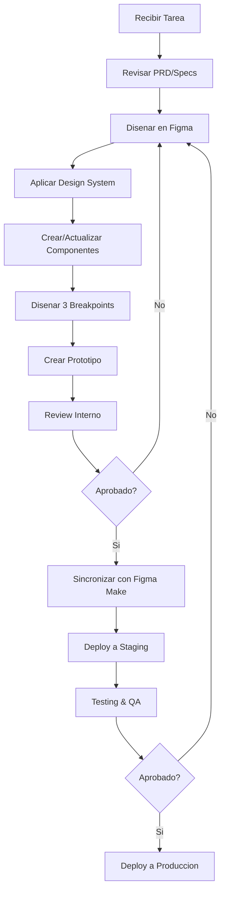

# Guia de Desarrollo - Papelera del Pacífico

## Tabla de Contenidos

- [Introduccion](#introduccion)
- [Setup Inicial](#setup-inicial)
- [Workflow de Desarrollo](#workflow-de-desarrollo)
- [Trabajando con Figma](#trabajando-con-figma)
- [Trabajando con Figma Make](#trabajando-con-figma-make)
- [Convenciones y Estandares](#convenciones-y-estandares)
- [Best Practices](#best-practices)
- [Troubleshooting](#troubleshooting)

## Introduccion

Esta guia proporciona instrucciones detalladas para desarrolladores y disenadores que trabajen en el sitio web de Papelera del Pacífico. El proyecto utiliza un flujo de trabajo basado en Figma Make, donde el diseno en Figma es la fuente de verdad que se convierte automaticamente en un sitio web funcional.

### Prerequisitos

Antes de comenzar, asegurate de tener:

- [ ] Cuenta de Figma (plan Professional o superior recomendado)
- [ ] Acceso al archivo de Figma del proyecto
- [ ] Cuenta de Figma Make
- [ ] Familiaridad basica con Figma
- [ ] Conocimientos de diseno web y UX
- [ ] Acceso a assets del proyecto (imagenes, logos)

### Herramientas Recomendadas

- **Figma Desktop App**: Para mejor rendimiento
- **Navegador**: Chrome o Firefox (ultimas versiones)
- **Editor de Imagenes**: Photoshop, Figma, o herramienta similar
- **Compresion de Imagenes**: TinyPNG, ImageOptim, Squoosh

## Setup Inicial

### 1. Acceso al Proyecto

#### Acceder al Archivo de Figma

1. Recibe invitacion al archivo de Figma
2. Abre el link de invitacion
3. Acepta la invitacion
4. El archivo aparecera en tu seccion "Shared with you"

**URL del Proyecto:**
```
[URL del archivo de Figma - Pendiente agregar]
```

#### Configurar Permisos

Asegurate de tener los permisos correctos:

- **Editor**: Puede editar disenos
- **Viewer**: Solo puede ver y comentar
- **Admin**: Control total del archivo

### 2. Familiarizacion con el Archivo

#### Estructura del Archivo

Al abrir el archivo, veras estas paginas principales:

```
1. 00_Documentation - Informacion del proyecto
2. 00_Design_System - Sistema de diseno
3. 00_Components - Biblioteca de componentes
4. 01_Home - Pagina de inicio
5. 02_Nosotros - Pagina Nosotros
6. 03_Productos_Listado - Listado de productos
7. 04_Productos_Detalle - Detalle de producto
8. 05_Contacto - Pagina de contacto
9. 06_Prototype - Conexiones de prototipo
```

#### Tour Inicial

1. **Revisa la Documentation**: Lee las notas y especificaciones
2. **Explora el Design System**: Familiarízate con colores, tipografía, componentes
3. **Revisa los Components**: Entiende como se construyen los componentes
4. **Navega las Paginas**: Mira el diseno en los 3 breakpoints

### 3. Configurar Figma Make

#### Crear Cuenta

1. Ve a [Figma Make website]
2. Registrate con tu email
3. Verifica tu cuenta

#### Conectar con Figma

1. En Figma Make dashboard, click "New Project"
2. Autoriza acceso a Figma
3. Selecciona el archivo "Papelera del Pacífico - Sitio Web"
4. Configura nombre del proyecto

#### Configuracion Inicial

```json
{
  "projectName": "Papelera del Pacífico",
  "figmaFileKey": "[FILE_KEY]",
  "pages": [
    "01_Home",
    "02_Nosotros",
    "03_Productos_Listado",
    "04_Productos_Detalle",
    "05_Contacto"
  ],
  "breakpoints": {
    "desktop": "1440",
    "tablet": "768",
    "mobile": "375"
  }
}
```

## Workflow de Desarrollo

### Flujo General



### Proceso Paso a Paso

#### Fase 1: Planificacion

1. **Recibir Tarea**
   - Revisar ticket o solicitud
   - Leer especificaciones en PRD
   - Clarificar dudas con stakeholders

2. **Investigacion**
   - Revisar componentes existentes
   - Verificar si hay patrones reutilizables
   - Recopilar assets necesarios

3. **Planificar Estructura**
   - Identificar componentes nuevos vs existentes
   - Planificar jerarquia de informacion
   - Definir interacciones necesarias

#### Fase 2: Diseno en Figma

1. **Preparar Frame**
   ```
   - Crear nuevo frame o duplicar existente
   - Nombrar apropiadamente: [Pagina]_[Breakpoint]_[Version]
   - Configurar grid (12 columnas, 20px gutter)
   ```

2. **Disenar Desktop (1440px)**
   ```
   - Empezar con version desktop
   - Usar componentes de la biblioteca
   - Aplicar design system (colores, tipografia)
   - Mantener espaciado consistente
   ```

3. **Disenar Tablet (768px)**
   ```
   - Duplicar frame desktop
   - Ajustar a 768px width
   - Adaptar layout (ej: 3 columnas -> 2 columnas)
   - Reducir tamaños de tipografia segun escala
   - Ajustar espaciado
   ```

4. **Disenar Mobile (375px)**
   ```
   - Duplicar frame tablet
   - Ajustar a 375px width
   - Stack vertical (columnas -> stack)
   - Usar tipografia mobile
   - Ajustar touch targets (minimo 44px)
   ```

#### Fase 3: Componentizacion

1. **Identificar Elementos Reutilizables**
   ```
   - Elementos que se repiten
   - Elementos con multiples estados
   - Elementos que pueden variar
   ```

2. **Crear Componente**
   ```
   - Seleccionar elemento
   - Click derecho > Create Component
   - Nombrar: Component/[Categoria]/[Nombre]
   - Mover a pagina "00_Components"
   ```

3. **Configurar Auto Layout**
   ```
   - Seleccionar componente
   - Shift + A (Auto Layout)
   - Configurar direccion (Horizontal/Vertical)
   - Configurar padding
   - Configurar spacing entre elementos
   ```

4. **Crear Variantes**
   ```
   - Seleccionar componentes relacionados
   - Click derecho > Combine as Variants
   - Configurar properties (State, Type, Size, etc)
   - Nombrar properties claramente
   ```

#### Fase 4: Aplicar Design System

1. **Colores**
   ```
   - NO usar hex codes directamente
   - SIEMPRE usar Color Styles
   - Verificar contraste de accesibilidad
   ```

2. **Tipografia**
   ```
   - NO configurar fuentes manualmente
   - SIEMPRE usar Text Styles
   - H1, H2, H3 para headings
   - Body para texto normal
   ```

3. **Espaciado**
   ```
   - Usar sistema de espaciado (8px base)
   - Valores comunes: 8, 16, 24, 32, 48, 64
   - Auto Layout para spacing consistente
   ```

4. **Efectos**
   ```
   - Usar Effect Styles para sombras
   - No crear sombras custom sin necesidad
   ```

#### Fase 5: Prototipado

1. **Crear Conexiones**
   ```
   - Cambiar a tab "Prototype"
   - Conectar frames con flujos de navegacion
   - Configurar interacciones (On Click, On Hover)
   - Definir animaciones (Instant, Dissolve, Slide)
   ```

2. **Configurar Overlays**
   ```
   - Para menus mobile
   - Para modals
   - Configurar comportamiento (Close when clicking outside)
   ```

3. **Testear Prototipo**
   ```
   - Click en "Play" (esquina superior derecha)
   - Navegar a traves del flujo
   - Verificar interacciones
   - Probar en diferentes dispositivos
   ```

#### Fase 6: Review y Ajustes

1. **Auto-Review**
   ```
   - Verificar naming de layers
   - Confirmar uso de componentes
   - Validar design system
   - Revisar responsive en 3 breakpoints
   - Verificar accesibilidad
   ```

2. **Peer Review**
   ```
   - Compartir link de prototipo
   - Solicitar feedback
   - Documentar comentarios en Figma
   ```

3. **Ajustes**
   ```
   - Implementar feedback
   - Re-verificar cambios
   - Marcar comentarios como resueltos
   ```

## Trabajando con Figma

### Atajos de Teclado Esenciales

#### Navegacion
```
Space + Drag: Pan (mover vista)
Ctrl/Cmd + Scroll: Zoom
Ctrl/Cmd + 0: Zoom to fit
Ctrl/Cmd + 1: Zoom to 100%
```

#### Herramientas
```
V: Move tool
F: Frame tool
R: Rectangle
T: Text
Shift + A: Auto Layout
Ctrl/Cmd + G: Group
Ctrl/Cmd + D: Duplicate
```

#### Componentes
```
Ctrl/Cmd + Alt + K: Create Component
Ctrl/Cmd + Alt + B: Detach Instance
Alt + Drag: Duplicate
```

#### Organizacion
```
Ctrl/Cmd + ]: Bring Forward
Ctrl/Cmd + [: Send Backward
Ctrl/Cmd + Alt + ]: Bring to Front
Ctrl/Cmd + Alt + [: Send to Back
```

### Trabajando con Componentes

#### Crear Componente

1. Disenar el elemento
2. Seleccionar todas las capas
3. `Ctrl/Cmd + Alt + K` o Click derecho > Create Component
4. Nombrar claramente
5. Mover a pagina Components

#### Usar Instancia

1. Abrir panel Assets (Alt + 2)
2. Buscar componente
3. Drag & drop al canvas
4. Personalizar overrides si es necesario

#### Modificar Componente Master

1. Navegar a pagina Components
2. Localizar componente master (icono de diamante)
3. Editar componente
4. Todas las instancias se actualizaran automaticamente

### Trabajando con Auto Layout

#### Configurar Auto Layout

1. Seleccionar frame o grupo
2. `Shift + A` o Click derecho > Add Auto Layout
3. Configurar:
   - Direccion (Horizontal/Vertical)
   - Padding (arriba, derecha, abajo, izquierda)
   - Spacing entre items
   - Alignment

#### Nested Auto Layout

```
Frame Principal (Auto Layout Vertical)
├── Header (Auto Layout Horizontal)
│   ├── Logo
│   └── Nav Items (Auto Layout Horizontal)
├── Content (Auto Layout Vertical)
│   ├── Title
│   └── Description
└── Footer (Auto Layout Horizontal)
```

### Trabajando con Constraints

#### Configurar Constraints

En panel de propiedades, seccion "Constraints":

```
Horizontal: Left / Right / Center / Left & Right / Scale
Vertical: Top / Bottom / Center / Top & Bottom / Scale
```

**Uso Comun:**
- Logo: Left + Top (se queda en esquina)
- Boton centrado: Center + Top
- Footer: Left & Right + Bottom (se estira y queda abajo)

### Exportar Assets

#### Configurar Export Settings

1. Seleccionar layer
2. Panel derecho > Export
3. Click "+"
4. Configurar:
   - Formato: PNG, JPG, SVG, PDF
   - Tamano: 1x, 2x, 3x
   - Suffix (opcional): @2x

#### Exportar Multiples Assets

1. Marcar layers para exportar
2. File > Export...
3. Seleccionar destination folder
4. Export all

## Trabajando con Figma Make

### Configuracion del Proyecto

#### Mapeo de Paginas

En Figma Make dashboard:

1. **Page Mapping**
   ```
   Figma Frame -> Website Page
   01_Home_Desktop_1440 -> /index.html (Home)
   02_Nosotros_Desktop_1440 -> /nosotros
   03_Productos_Listado_Desktop_1440 -> /productos
   04_Productos_Detalle_Desktop_1440 -> /productos/[slug]
   05_Contacto_Desktop_1440 -> /contacto
   ```

2. **Breakpoint Configuration**
   ```
   Desktop: 01_Home_Desktop_1440
   Tablet: 01_Home_Tablet_768
   Mobile: 01_Home_Mobile_375
   ```

#### SEO Configuration

Para cada pagina:

```json
{
  "title": "Papelera del Pacífico - Productos de Papel de Calidad",
  "description": "Fabricantes de papel toalla, papel higienico y sabanilla medica bajo la marca Maxifort. Calidad y compromiso.",
  "keywords": "papel toalla, papel higienico, sabanilla medica, maxifort, chile",
  "ogImage": "/assets/og-image.jpg"
}
```

### Sincronizacion

#### Sincronizar Diseno

1. En Figma Make dashboard
2. Click "Sync from Figma"
3. Esperar sincronizacion (1-5 minutos)
4. Revisar cambios detectados
5. Confirmar sync

#### Build del Sitio

Despues de sync:

1. Figma Make genera codigo automaticamente
2. Optimiza assets
3. Crea versiones responsive
4. Genera sitemap

#### Preview

1. Click "Preview"
2. Se abre tab con sitio generado
3. Navegar y probar
4. Verificar responsive (DevTools)

### Deploy

#### Deploy a Staging

1. En Figma Make dashboard
2. Click "Deploy to Staging"
3. Esperar deployment (~2-5 min)
4. URL de staging disponible
5. Compartir con equipo para QA

#### Deploy a Produccion

1. Asegurar aprobacion de stakeholders
2. Verificar staging completamente
3. Click "Deploy to Production"
4. Confirmar deploy
5. Esperar deployment
6. Verificar sitio en vivo

## Convenciones y Estandares

### Naming Conventions

#### Layers en Figma

```
PascalCase para componentes:
  Button Primary
  Product Card
  Header Desktop

kebab-case para instancias:
  product-card-01
  hero-image
  contact-form

Descriptivo y especifico:
  NO: Rectangle 1, Group 45
  SI: Product Image, CTA Button, Price Label
```

#### Frames

```
Formato: [Pagina]_[Breakpoint]_[Width]

Ejemplos:
  01_Home_Desktop_1440
  02_Nosotros_Tablet_768
  03_Productos_Mobile_375
```

#### Componentes

```
Formato: Component/[Categoria]/[Nombre]

Ejemplos:
  Component/Button/Primary
  Component/Card/Product
  Component/Form/Input
  Component/Navigation/Header-Desktop
```

#### Color Styles

```
Formato: [Grupo]/[Subgrupo]/[Nombre]

Ejemplos:
  Brand/Primary/Gold
  Brand/Secondary/Blue
  Neutral/500
  State/Error
```

#### Text Styles

```
Formato: [Tipo]/[Variante]

Ejemplos:
  H1/Desktop
  H2/Tablet
  Body/Regular
  Button/Text
```

### Organizacion de Layers

#### Jerarquia Clara

```
✓ BUENO:
Page Frame
├── Header
│   ├── Logo
│   ├── Navigation
│   │   ├── Nav Link 1
│   │   ├── Nav Link 2
│   │   └── Nav Link 3
│   └── CTA Button
├── Main Content
│   ├── Hero Section
│   └── Features Section
└── Footer

✗ MALO:
Page Frame
├── Rectangle 1
├── Group 23
├── Frame 456
└── Text 789
```

#### Agrupar Elementos Relacionados

```
Usar Frames (no Groups) para:
- Secciones de pagina
- Componentes
- Layouts con Auto Layout

Usar Groups solo para:
- Agrupaciones temporales
- Elementos puramente visuales sin layout
```

### Mejores Practicas de Diseno

#### 1. Usa el Design System

```
✓ Siempre usar Color Styles
✓ Siempre usar Text Styles
✓ Siempre usar Effect Styles
✓ Seguir sistema de espaciado
✗ NO crear estilos custom sin razon
```

#### 2. Componentiza Todo lo Reutilizable

```
✓ Botones -> Componente
✓ Cards -> Componente
✓ Forms -> Componente
✓ Headers/Footers -> Componente
✗ NO duplicar elementos manualmente
```

#### 3. Auto Layout es tu Amigo

```
✓ Usar Auto Layout para layouts flexibles
✓ Configura padding y spacing
✓ Permite redimensionamiento automatico
✗ NO posicionar elementos manualmente si Auto Layout puede hacerlo
```

#### 4. Nombra Todo Claramente

```
✓ Nombres descriptivos
✓ Consistencia en naming
✓ Evita nombres genericos
✗ "Rectangle 23" ✗
✓ "Product Image Background" ✓
```

#### 5. Mantén Organizado

```
✓ Paginas bien organizadas
✓ Componentes en pagina dedicada
✓ Frames nombrados consistentemente
✓ Layers jerarquizados logicamente
```

## Best Practices

### Performance

#### Optimizacion de Imagenes

```
Antes de importar a Figma:
1. Redimensionar a tamano necesario (no mas grande)
2. Comprimir (TinyPNG, ImageOptim)
3. Formato apropiado:
   - PNG: Logos, imagenes con transparencia
   - JPG: Fotografias
   - SVG: Iconos, ilustraciones vectoriales
```

**Tamanos Recomendados:**
```
Product images: 800x800px
Hero images: 1920x1080px
Icons: 24x24px, 32x32px, 48x48px
Logos: Vector (SVG) o PNG 2x tamano de uso
```

#### Reducir Complejidad

```
✓ Simplificar formas cuando sea posible
✓ Flatten layers que no necesitan editarse
✓ Eliminar layers ocultos no necesarios
✓ Reducir efectos complejos
```

### Accesibilidad

#### Contraste de Color

Verificar siempre:

```
Texto normal (16px+): Minimo 4.5:1
Texto grande (24px+): Minimo 3:1
Elementos UI: Minimo 3:1
```

**Herramientas:**
- Plugin "Contrast" en Figma
- WebAIM Contrast Checker
- Chrome DevTools Contrast Checker

#### Touch Targets

```
Minimo 44x44px para elementos interactivos en mobile
Espacio suficiente entre elementos clickables
```

#### Textos Alternativos

```
Documentar alt text necesario para imagenes
Especialmente imagenes con informacion importante
```

### Responsive Design

#### Mobile-First Thinking

```
1. Disenar para mobile primero (opcional)
2. Expandir a tablet
3. Expandir a desktop

O al reves, pero SIEMPRE disenar los 3
```

#### Breakpoint Considerations

```
Desktop (1440px+):
- Layouts de 3-4 columnas
- Navegacion horizontal
- Espaciado generoso

Tablet (768px):
- Layouts de 2 columnas
- Navegacion compacta
- Espaciado medio

Mobile (375px):
- Layout de 1 columna (stack)
- Menu hamburguesa
- Espaciado reducido
- Touch-friendly
```

### Collaboration

#### Commenting

```
✓ Dejar comentarios claros
✓ Mencionar personas relevantes (@nombre)
✓ Marcar como resuelto cuando se complete
✓ Usar threads para discusiones
```

#### Version Control

```
✓ Guardar versiones importantes
✓ Nombrar versiones claramente
✓ Documentar cambios significativos
```

#### Handoff

```
Antes de handoff a Figma Make:
1. Verificar design system aplicado
2. Confirmar nombres claros
3. Validar 3 breakpoints
4. Testear prototipo
5. Resolver todos los comentarios
6. Documentar especificaciones especiales
```

## Troubleshooting

### Problemas Comunes en Figma

#### El Auto Layout no se comporta como espero

**Solucion:**
```
1. Verificar direccion (Horizontal/Vertical)
2. Revisar constraints de elementos hijos
3. Confirmar que no hay absolute positioning
4. Verificar que todos los elementos estan dentro del auto layout
5. Revisar padding y spacing values
```

#### Los componentes no se actualizan

**Solucion:**
```
1. Verificar que estas editando el Master component, no una instancia
2. Refrescar el archivo (Ctrl/Cmd + R)
3. Verificar que no has detached la instancia
4. Revisar overrides aplicados
```

#### El prototipo no funciona

**Solucion:**
```
1. Verificar que los frames estan conectados
2. Confirmar trigger configurado (On Click, etc)
3. Verificar que destination frame existe
4. Revisar overlays configurados correctamente
5. Refrescar preview
```

### Problemas Comunes en Figma Make

#### La sincronizacion falla

**Solucion:**
```
1. Verificar permisos del archivo de Figma
2. Confirmar que los frames tienen nombres correctos
3. Revisar que no hay caracteres especiales en nombres
4. Intentar re-conectar archivo de Figma
5. Contactar soporte de Figma Make
```

#### El sitio generado no se ve bien

**Solucion:**
```
1. Verificar que Auto Layout esta aplicado
2. Confirmar constraints configurados
3. Revisar que las imagenes no estan rotadas/distorsionadas
4. Verificar que los textos estan en text layers (no outlines)
5. Re-sincronizar desde Figma
```

#### El responsive no funciona

**Solucion:**
```
1. Confirmar que los 3 frames estan nombrados consistentemente
2. Verificar mapeo de breakpoints en Figma Make
3. Revisar constraints en elementos
4. Verificar Auto Layout configurado correctamente
5. Testear en preview con DevTools
```

### Obteniendo Ayuda

#### Recursos

```
Documentacion de Figma:
https://help.figma.com

Figma Community:
https://forum.figma.com

Figma Make Support:
[URL de soporte]

Team Lead:
[Nombre y contacto]
```

#### Reportar Issues

Cuando reportes un problema:

```
1. Descripcion clara del problema
2. Pasos para reproducir
3. Screenshots si es visual
4. Link al archivo/frame de Figma
5. Navegador/dispositivo si es deployment
```

---

**Documento Mantenido por:** Equipo de Desarrollo AgenciaDos
**Ultima Actualizacion:** Noviembre 2025
**Version:** 1.0
