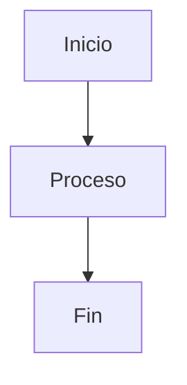

# Indice de Documentacion - Papelera del Pacífico

## Bienvenido a la Documentacion del Proyecto

Esta es la documentacion tecnica completa del sitio web corporativo de Papelera del Pacífico. La documentacion esta organizada por areas de responsabilidad y nivel de detalle.

---

## Inicio Rapido

### Para Nuevos Miembros del Equipo

1. Lee el [README.md](../README.md) para una vision general del proyecto
2. Revisa [ARCHITECTURE.md](ARCHITECTURE.md) para entender la estructura tecnica
3. Familiarizate con [DESIGN_SYSTEM.md](DESIGN_SYSTEM.md) antes de disenar
4. Sigue [DEVELOPMENT_GUIDE.md](DEVELOPMENT_GUIDE.md) para empezar a trabajar

### Para Actualizaciones Rapidas

- **Actualizar contenido**: [CONTENT_MANAGEMENT.md](CONTENT_MANAGEMENT.md)
- **Publicar cambios**: [DEPLOYMENT.md](DEPLOYMENT.md)
- **Resolver problemas**: Seccion Troubleshooting en cada documento

---

## Estructura de la Documentacion

### 1. README.md

**Ubicacion:** `D:\Documentos\AgenciaDos\Papelera-del-Pacifico\ayd-web\README.md`

**Audiencia:** Todos

**Contenido:**
- Vision general del proyecto
- Stack tecnologico
- Quick start guide
- Estructura del proyecto
- Links a documentacion adicional
- Informacion de contacto

**Cuando usar:**
- Primera vez accediendo al proyecto
- Necesitas una vision general rapida
- Buscas links a documentacion especifica

---

### 2. ARCHITECTURE.md

**Ubicacion:** `D:\Documentos\AgenciaDos\Papelera-del-Pacifico\ayd-web\docs\ARCHITECTURE.md`

**Audiencia:** Desarrolladores, Tech Leads, Arquitectos

**Contenido:**
- Vision general de arquitectura
- Stack tecnologico detallado
- Arquitectura del sistema (diagramas)
- Estructura de archivos y carpetas
- Flujo de desarrollo (Figma → Figma Make → Deploy)
- Configuracion de environments (dev, staging, prod)
- Architecture Decision Records (ADRs)
- Consideraciones de performance
- Seguridad y escalabilidad

**Cuando usar:**
- Necesitas entender la arquitectura tecnica
- Planificando cambios estructurales
- Debugging de problemas complejos
- Onboarding de nuevos desarrolladores

**Secciones Clave:**
- Diagrama de arquitectura general
- Flujo de desarrollo completo
- Configuracion de environments
- ADRs (decisiones arquitectonicas)

---

### 3. DESIGN_SYSTEM.md

**Ubicacion:** `D:\Documentos\AgenciaDos\Papelera-del-Pacifico\ayd-web\docs\DESIGN_SYSTEM.md`

**Audiencia:** Disenadores, Desarrolladores Frontend

**Contenido:**
- Principios de diseno
- Tokens de diseno (colores, tipografia, espaciado)
- Guia completa de componentes
- Patrones de UI reutilizables
- Responsive design guidelines
- Accesibilidad (WCAG 2.1 AA)
- Implementacion en Figma
- Checklist de calidad

**Cuando usar:**
- Disenando nuevas paginas o componentes
- Necesitas especificaciones de colores/tipografia
- Creando componentes nuevos
- Verificando consistencia de diseno
- Asegurando accesibilidad

**Secciones Clave:**
- Paleta de colores completa
- Escala tipografica (desktop, tablet, mobile)
- Guia de componentes con specs
- Sistema de espaciado
- Patrones responsive

---

### 4. DEVELOPMENT_GUIDE.md

**Ubicacion:** `D:\Documentos\AgenciaDos\Papelera-del-Pacifico\ayd-web\docs\DEVELOPMENT_GUIDE.md`

**Audiencia:** Disenadores, Desarrolladores

**Contenido:**
- Setup inicial del proyecto
- Workflow de desarrollo paso a paso
- Trabajando con Figma (atajos, componentes, Auto Layout)
- Trabajando con Figma Make (sync, build, deploy)
- Convenciones de codigo y naming
- Best practices
- Troubleshooting comun

**Cuando usar:**
- Primera vez trabajando en el proyecto
- Necesitas hacer cambios en Figma
- Vas a publicar cambios via Figma Make
- Tienes problemas con componentes o responsive
- Necesitas refrescar best practices

**Secciones Clave:**
- Workflow de desarrollo completo (con diagrama)
- Atajos de teclado esenciales en Figma
- Como crear y usar componentes
- Como hacer deployment
- Troubleshooting de problemas comunes

---

### 5. CONTENT_MANAGEMENT.md

**Ubicacion:** `D:\Documentos\AgenciaDos\Papelera-del-Pacifico\ayd-web\docs\CONTENT_MANAGEMENT.md`

**Audiencia:** Content Managers, Marketing, Cliente

**Contenido:**
- Content guidelines (tono, estilo)
- Gestion de productos (agregar, actualizar, eliminar)
- Gestion de paginas
- Gestion de imagenes (estandares, optimizacion)
- Guia de estilo editorial
- SEO y metadata
- Workflow de publicacion

**Cuando usar:**
- Agregando nuevos productos
- Actualizando contenido existente
- Optimizando imagenes
- Escribiendo nuevos textos
- Mejorando SEO

**Secciones Clave:**
- Template de informacion de producto
- Como agregar/actualizar productos (paso a paso)
- Estandares de imagenes
- Guia de estilo editorial
- SEO guidelines

---

### 6. DEPLOYMENT.md

**Ubicacion:** `D:\Documentos\AgenciaDos\Papelera-del-Pacifico\ayd-web\docs\DEPLOYMENT.md`

**Audiencia:** Tech Leads, DevOps, Project Managers

**Contenido:**
- Configuracion de environments (staging, production)
- Proceso de deployment completo
- Checklist pre-lanzamiento exhaustivo
- Proceso de rollback
- Troubleshooting de deployment
- Monitoreo post-deployment

**Cuando usar:**
- Publicando cambios a produccion
- Necesitas hacer deploy a staging
- Algo salio mal y necesitas rollback
- Preparando un lanzamiento importante
- Verificando que todo este listo pre-launch

**Secciones Clave:**
- Proceso de deployment paso a paso
- Checklist pre-lanzamiento (completo)
- Como hacer rollback
- Troubleshooting de problemas comunes
- Metricas a monitorear post-deploy

---

### 7. INTEGRATIONS.md

**Ubicacion:** `D:\Documentos\AgenciaDos\Papelera-del-Pacifico\ayd-web\docs\INTEGRATIONS.md`

**Audiencia:** Desarrolladores, Marketing

**Contenido:**
- Google Analytics (GA4) - setup completo
- Google Maps - configuracion
- Formulario de contacto
- Redes sociales
- Google Search Console
- Email marketing (opcional)
- Otras integraciones

**Cuando usar:**
- Configurando Google Analytics
- Integrando Google Maps
- Configurando formulario de contacto
- Agregando tracking de eventos
- Troubleshooting de integraciones

**Secciones Clave:**
- Setup de Google Analytics paso a paso
- Configuracion de eventos y conversiones
- Como integrar Google Maps
- Configuracion de formulario de contacto
- Anti-spam para formularios

---

### 8. MAINTENANCE.md

**Ubicacion:** `D:\Documentos\AgenciaDos\Papelera-del-Pacifico\ayd-web\docs\MAINTENANCE.md`

**Audiencia:** Todos, especialmente Operations

**Contenido:**
- Plan de mantenimiento (diario, semanal, mensual)
- Actualizaciones de contenido
- Estrategia de backups
- Monitoreo continuo
- Procedimientos de soporte
- Escalamiento
- Contactos y responsabilidades

**Cuando usar:**
- Planificando tareas de mantenimiento
- Necesitas hacer backup
- Configurando monitoreo
- Reportando o resolviendo issues
- Buscando contactos del equipo

**Secciones Clave:**
- Tareas de mantenimiento (diario/semanal/mensual)
- Como hacer backups
- Herramientas de monitoreo
- Niveles de severidad y SLAs
- Contactos del equipo

---

## Documentacion por Rol

### Para Disenadores

**Lectura esencial:**
1. [DESIGN_SYSTEM.md](DESIGN_SYSTEM.md) - Sistema de diseno completo
2. [DEVELOPMENT_GUIDE.md](DEVELOPMENT_GUIDE.md) - Workflow en Figma
3. [CONTENT_MANAGEMENT.md](CONTENT_MANAGEMENT.md) - Gestion de assets

**Lectura recomendada:**
- [ARCHITECTURE.md](ARCHITECTURE.md) - Seccion de estructura de archivos
- [DEPLOYMENT.md](DEPLOYMENT.md) - Proceso de publicacion

### Para Desarrolladores

**Lectura esencial:**
1. [ARCHITECTURE.md](ARCHITECTURE.md) - Arquitectura completa
2. [DEVELOPMENT_GUIDE.md](DEVELOPMENT_GUIDE.md) - Workflow de desarrollo
3. [DEPLOYMENT.md](DEPLOYMENT.md) - Deployment y troubleshooting

**Lectura recomendada:**
- [DESIGN_SYSTEM.md](DESIGN_SYSTEM.md) - Componentes y patrones
- [INTEGRATIONS.md](INTEGRATIONS.md) - Configuracion de servicios
- [MAINTENANCE.md](MAINTENANCE.md) - Monitoreo y soporte

### Para Content Managers

**Lectura esencial:**
1. [CONTENT_MANAGEMENT.md](CONTENT_MANAGEMENT.md) - Gestion de contenido completa
2. [DEVELOPMENT_GUIDE.md](DEVELOPMENT_GUIDE.md) - Como hacer cambios en Figma

**Lectura recomendada:**
- [DESIGN_SYSTEM.md](DESIGN_SYSTEM.md) - Guia de estilo visual
- [DEPLOYMENT.md](DEPLOYMENT.md) - Como publicar cambios

### Para Project Managers

**Lectura esencial:**
1. [README.md](../README.md) - Vision general
2. [DEPLOYMENT.md](DEPLOYMENT.md) - Proceso y checklists
3. [MAINTENANCE.md](MAINTENANCE.md) - Plan de mantenimiento

**Lectura recomendada:**
- [ARCHITECTURE.md](ARCHITECTURE.md) - Decisiones arquitectonicas
- [INTEGRATIONS.md](INTEGRATIONS.md) - Servicios externos
- Todos los demas documentos (overview)

### Para Cliente (Papelera del Pacífico)

**Lectura esencial:**
1. [README.md](../README.md) - Que es el proyecto
2. [CONTENT_MANAGEMENT.md](CONTENT_MANAGEMENT.md) - Como actualizar contenido

**Lectura opcional:**
- [MAINTENANCE.md](MAINTENANCE.md) - Que mantenimiento se realiza
- [DEPLOYMENT.md](DEPLOYMENT.md) - Como se publican cambios

---

## Documentacion por Tarea

### Quiero agregar un nuevo producto

1. Lee [CONTENT_MANAGEMENT.md](CONTENT_MANAGEMENT.md) - Seccion "Como Agregar un Nuevo Producto"
2. Prepara assets segun [CONTENT_MANAGEMENT.md](CONTENT_MANAGEMENT.md) - Seccion "Gestion de Imagenes"
3. Usa componentes de [DESIGN_SYSTEM.md](DESIGN_SYSTEM.md) - Seccion "Componentes > Product Card"
4. Sigue workflow de [DEVELOPMENT_GUIDE.md](DEVELOPMENT_GUIDE.md) - Seccion "Workflow de Desarrollo"
5. Deploy siguiendo [DEPLOYMENT.md](DEPLOYMENT.md)

### Quiero actualizar el contenido de una pagina

1. Lee [CONTENT_MANAGEMENT.md](CONTENT_MANAGEMENT.md) - Seccion "Gestion de Paginas"
2. Edita en Figma segun [DEVELOPMENT_GUIDE.md](DEVELOPMENT_GUIDE.md) - Seccion "Trabajando con Figma"
3. Publica segun [DEPLOYMENT.md](DEPLOYMENT.md) - Seccion "Deployment a Produccion"

### Quiero crear un nuevo componente

1. Revisa [DESIGN_SYSTEM.md](DESIGN_SYSTEM.md) - Asegurate que no existe
2. Sigue [DEVELOPMENT_GUIDE.md](DEVELOPMENT_GUIDE.md) - Seccion "Fase 3: Componentizacion"
3. Aplica principios de [DESIGN_SYSTEM.md](DESIGN_SYSTEM.md) - Seccion "Tokens de Diseno"
4. Documenta el nuevo componente

### Quiero publicar cambios a produccion

1. Verifica checklist de [DEPLOYMENT.md](DEPLOYMENT.md) - Seccion "Checklist Pre-Lanzamiento"
2. Sigue proceso de [DEPLOYMENT.md](DEPLOYMENT.md) - Seccion "Deployment a Produccion"
3. Monitorea segun [DEPLOYMENT.md](DEPLOYMENT.md) - Seccion "Monitoreo Post-Deployment"

### El sitio esta caido o tiene un problema critico

1. Sigue [MAINTENANCE.md](MAINTENANCE.md) - Seccion "Nivel 1 - Critico"
2. Si necesitas rollback: [DEPLOYMENT.md](DEPLOYMENT.md) - Seccion "Proceso de Rollback"
3. Revisa troubleshooting en cada documento relevante

### Quiero optimizar el SEO

1. Lee [CONTENT_MANAGEMENT.md](CONTENT_MANAGEMENT.md) - Seccion "SEO y Metadata"
2. Configura Search Console segun [INTEGRATIONS.md](INTEGRATIONS.md)
3. Monitorea con [MAINTENANCE.md](MAINTENANCE.md) - Seccion "Google Search Console"

### Quiero configurar Google Analytics

1. Sigue [INTEGRATIONS.md](INTEGRATIONS.md) - Seccion "Google Analytics" completa
2. Configura eventos y conversiones
3. Monitorea segun [MAINTENANCE.md](MAINTENANCE.md) - Seccion "Google Analytics"

---

## Convenciones de la Documentacion

### Formato

Todos los documentos estan en **Markdown (.md)** para:
- Facil lectura en GitHub/editores de texto
- Versionable con git
- Facil de editar y mantener

### Estructura

Cada documento sigue esta estructura:
```
# Titulo del Documento

## Tabla de Contenidos
[Links a secciones principales]

## Seccion 1
### Subseccion 1.1
### Subseccion 1.2

## Seccion 2
...

---
Informacion de mantenimiento al final
```

### Code Blocks

```markdown
Se usan bloques de codigo con syntax highlighting:

```javascript
// Codigo JavaScript
```

```html
<!-- Codigo HTML -->
```

```css
/* Codigo CSS */
```
```

### Diagramas

Se usan diagramas Mermaid cuando es util:



### Checklists

Se usan checklists para tareas:

```markdown
[ ] Tarea 1
[ ] Tarea 2
[x] Tarea completada
```

---

## Mantenimiento de la Documentacion

### Responsabilidad

**Document Owner:** Project Manager

**Contribuidores:**
- Tech Lead: ARCHITECTURE.md, DEPLOYMENT.md, INTEGRATIONS.md
- Lead Designer: DESIGN_SYSTEM.md
- Developer: DEVELOPMENT_GUIDE.md
- Content Manager: CONTENT_MANAGEMENT.md
- Operations: MAINTENANCE.md

### Actualizacion

La documentacion debe actualizarse cuando:
- Hay cambios significativos en el proyecto
- Se agregan nuevas funcionalidades
- Se cambian procesos
- Se descubren mejores practicas
- Se resuelven problemas no documentados

### Versionado

```
Version: 1.0 - Noviembre 2025 - Version inicial completa
Version: 1.1 - [Fecha futura] - [Cambios]
```

### Changelog

Mantener registro de cambios importantes en cada documento al final:

```markdown
## Changelog

### Version 1.1 - [Fecha]
- [Cambio 1]
- [Cambio 2]

### Version 1.0 - Noviembre 2025
- Version inicial
```

---

## Recursos Adicionales

### Documentacion Externa

**Figma:**
- [Figma Help Center](https://help.figma.com)
- [Figma Best Practices](https://www.figma.com/best-practices/)
- [Auto Layout Guide](https://help.figma.com/hc/en-us/articles/360040451373)

**Figma Make:**
- [Figma Make Documentation](https://figmake.com/docs) (verificar URL)
- [Figma Make Support](https://support.figmake.com) (verificar URL)

**Google Analytics:**
- [GA4 Documentation](https://support.google.com/analytics/answer/10089681)
- [GA4 Setup Guide](https://support.google.com/analytics/answer/9304153)

**SEO y Accesibilidad:**
- [Google Search Central](https://developers.google.com/search)
- [WCAG 2.1 Guidelines](https://www.w3.org/WAI/WCAG21/quickref/)
- [WebAIM](https://webaim.org/)

### Herramientas Recomendadas

**Diseno:**
- Figma Desktop App
- Figma Mirror (testing mobile)
- Plugin: Contrast (verificar accesibilidad)

**Optimizacion de Imagenes:**
- [TinyPNG](https://tinypng.com)
- [Squoosh](https://squoosh.app)
- [ImageOptim](https://imageoptim.com) (Mac)

**Testing:**
- Chrome DevTools
- Lighthouse
- [WAVE](https://wave.webaim.org)
- [GTmetrix](https://gtmetrix.com)

**Monitoreo:**
- [UptimeRobot](https://uptimerobot.com)
- Google Analytics
- Google Search Console

---

## Soporte

### Preguntas Sobre la Documentacion

Si tienes preguntas o encuentras errores en la documentacion:

```
Email: docs@agenciados.cl
Asunto: [AYD Docs] - [Tu pregunta]
```

### Sugerencias de Mejora

Agradecemos sugerencias para mejorar la documentacion:

```
Crear issue en repositorio
O email a: docs@agenciados.cl
```

### Problemas del Proyecto

Para problemas relacionados con el proyecto (no la docs):

Ver [MAINTENANCE.md](MAINTENANCE.md) - Seccion "Procedimientos de Soporte"

---

## Indice Alfabetico

- **Accesibilidad**: [DESIGN_SYSTEM.md](DESIGN_SYSTEM.md), [DEPLOYMENT.md](DEPLOYMENT.md)
- **ADR (Architecture Decision Records)**: [ARCHITECTURE.md](ARCHITECTURE.md)
- **Analytics**: [INTEGRATIONS.md](INTEGRATIONS.md), [MAINTENANCE.md](MAINTENANCE.md)
- **Auto Layout**: [DEVELOPMENT_GUIDE.md](DEVELOPMENT_GUIDE.md), [DESIGN_SYSTEM.md](DESIGN_SYSTEM.md)
- **Backups**: [MAINTENANCE.md](MAINTENANCE.md)
- **Breakpoints**: [ARCHITECTURE.md](ARCHITECTURE.md), [DESIGN_SYSTEM.md](DESIGN_SYSTEM.md)
- **Colores**: [DESIGN_SYSTEM.md](DESIGN_SYSTEM.md)
- **Componentes**: [DESIGN_SYSTEM.md](DESIGN_SYSTEM.md), [DEVELOPMENT_GUIDE.md](DEVELOPMENT_GUIDE.md)
- **Contenido**: [CONTENT_MANAGEMENT.md](CONTENT_MANAGEMENT.md)
- **Deployment**: [DEPLOYMENT.md](DEPLOYMENT.md), [ARCHITECTURE.md](ARCHITECTURE.md)
- **Diseno**: [DESIGN_SYSTEM.md](DESIGN_SYSTEM.md), [DEVELOPMENT_GUIDE.md](DEVELOPMENT_GUIDE.md)
- **Environments**: [ARCHITECTURE.md](ARCHITECTURE.md), [DEPLOYMENT.md](DEPLOYMENT.md)
- **Figma**: [DEVELOPMENT_GUIDE.md](DEVELOPMENT_GUIDE.md), [ARCHITECTURE.md](ARCHITECTURE.md)
- **Figma Make**: [ARCHITECTURE.md](ARCHITECTURE.md), [DEVELOPMENT_GUIDE.md](DEVELOPMENT_GUIDE.md)
- **Formulario**: [INTEGRATIONS.md](INTEGRATIONS.md)
- **Google Analytics**: [INTEGRATIONS.md](INTEGRATIONS.md)
- **Google Maps**: [INTEGRATIONS.md](INTEGRATIONS.md)
- **Imagenes**: [CONTENT_MANAGEMENT.md](CONTENT_MANAGEMENT.md), [DESIGN_SYSTEM.md](DESIGN_SYSTEM.md)
- **Integraciones**: [INTEGRATIONS.md](INTEGRATIONS.md)
- **Mantenimiento**: [MAINTENANCE.md](MAINTENANCE.md)
- **Monitoreo**: [MAINTENANCE.md](MAINTENANCE.md), [DEPLOYMENT.md](DEPLOYMENT.md)
- **Performance**: [ARCHITECTURE.md](ARCHITECTURE.md), [DEPLOYMENT.md](DEPLOYMENT.md)
- **Productos**: [CONTENT_MANAGEMENT.md](CONTENT_MANAGEMENT.md)
- **Responsive**: [DESIGN_SYSTEM.md](DESIGN_SYSTEM.md), [DEVELOPMENT_GUIDE.md](DEVELOPMENT_GUIDE.md)
- **Rollback**: [DEPLOYMENT.md](DEPLOYMENT.md)
- **SEO**: [CONTENT_MANAGEMENT.md](CONTENT_MANAGEMENT.md), [INTEGRATIONS.md](INTEGRATIONS.md)
- **Soporte**: [MAINTENANCE.md](MAINTENANCE.md)
- **Stack Tecnologico**: [ARCHITECTURE.md](ARCHITECTURE.md), [README.md](../README.md)
- **Tipografia**: [DESIGN_SYSTEM.md](DESIGN_SYSTEM.md)
- **Troubleshooting**: Todos los documentos tienen secciones de troubleshooting

---

**Ultima Actualizacion:** Noviembre 2025
**Version:** 1.0
**Mantenido por:** AgenciaDos - Equipo de Documentacion
