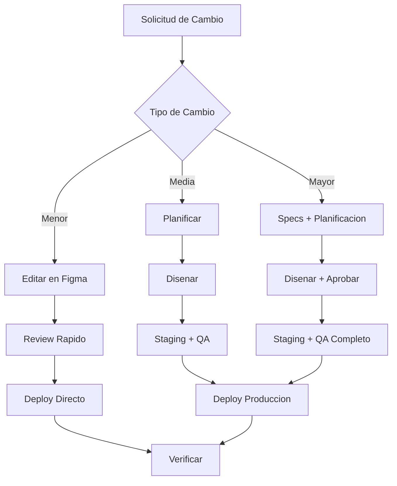

# Plan de Mantenimiento - Papelera del Pacífico

## Tabla de Contenidos

- [Introduccion](#introduccion)
- [Mantenimiento Regular](#mantenimiento-regular)
- [Actualizaciones de Contenido](#actualizaciones-de-contenido)
- [Backups](#backups)
- [Monitoreo](#monitoreo)
- [Procedimientos de Soporte](#procedimientos-de-soporte)
- [Escalamiento](#escalamiento)
- [Contactos y Responsabilidades](#contactos-y-responsabilidades)

## Introduccion

Este documento establece el plan de mantenimiento continuo para el sitio web de Papelera del Pacífico, incluyendo tareas regulares, procedimientos de actualizacion, estrategias de backup y protocolos de soporte.

### Objetivos del Mantenimiento

1. **Disponibilidad**: Mantener uptime >99.5%
2. **Performance**: Tiempo de carga <3 segundos
3. **Seguridad**: Proteger datos y prevenir vulnerabilidades
4. **Actualizacion**: Contenido siempre relevante y preciso
5. **Mejora Continua**: Optimizar basado en datos

## Mantenimiento Regular

### Tareas Diarias

#### Monitoreo Basico

**Responsable:** Equipo de Operaciones
**Tiempo Estimado:** 10 minutos
**Herramientas:** Google Analytics, Uptime Monitor

```
[ ] Verificar uptime (sitio esta arriba)
[ ] Revisar metricas de Google Analytics Real-Time
[ ] Verificar no hay errores criticos reportados
[ ] Revisar submissions de formulario de contacto
```

**Como Ejecutar:**

1. **Verificar Uptime**
   ```
   - Visitar: https://www.papeleraayd.cl
   - Verificar que carga correctamente
   - O usar UptimeRobot/Pingdom dashboard
   ```

2. **Google Analytics Real-Time**
   ```
   - analytics.google.com > Real-Time
   - Verificar datos estan llegando
   - Ver usuarios activos (si hay trafico esperado)
   ```

3. **Revisar Formulario**
   ```
   - Email: Revisar inbox para nuevos contactos
   - Figma Make: Dashboard > Forms > Submissions
   ```

### Tareas Semanales

#### Review de Metricas y Performance

**Responsable:** Digital Marketing Manager
**Tiempo Estimado:** 30-45 minutos
**Frecuencia:** Cada Lunes

```
[ ] Revisar metricas de trafico de la semana anterior
[ ] Analizar comportamiento de usuarios
[ ] Identificar paginas con problemas
[ ] Verificar performance (Lighthouse)
[ ] Revisar errores en Google Search Console
[ ] Actualizar dashboard de metricas
```

**Procedimiento:**

1. **Metricas de Trafico**
   ```
   Google Analytics > Reports > Engagement

   Revisar:
   - Total users vs semana anterior
   - Total pageviews
   - Bounce rate
   - Top pages
   - Traffic sources
   ```

2. **Performance Check**
   ```
   Chrome DevTools > Lighthouse
   - Correr audit en Home page
   - Verificar scores > 90 en todas las categorias
   - Si bajo, investigar y corregir
   ```

3. **Search Console**
   ```
   search.google.com/search-console

   Revisar:
   - Coverage: Errores de indexacion
   - Performance: Clicks, impressions, CTR
   - Enhancements: Core Web Vitals
   ```

4. **Documentar**
   ```
   Crear reporte semanal simple:
   - Metricas clave
   - Issues encontrados
   - Acciones tomadas
   ```

#### Backup Manual

**Responsable:** Tech Lead
**Tiempo Estimado:** 15 minutos
**Frecuencia:** Cada Viernes

```
[ ] Exportar version actual de Figma
[ ] Guardar screenshots de paginas principales
[ ] Backup de configuraciones de Figma Make
[ ] Verificar backups automaticos funcionando
```

**Procedimiento:**

Ver seccion [Backups](#backups) para detalles completos.

### Tareas Mensuales

#### Audit Completo

**Responsable:** Project Manager + Tech Lead
**Tiempo Estimado:** 2-3 horas
**Frecuencia:** Primer dia habil de cada mes

```
[ ] Audit de contenido
[ ] Review de SEO
[ ] Audit de performance
[ ] Review de accesibilidad
[ ] Analisis de competencia
[ ] Actualizacion de roadmap
```

**Checklist Detallado:**

1. **Audit de Contenido**
   ```
   [ ] Informacion de contacto actualizada
   [ ] Productos en catalogo vigentes
   [ ] Especificaciones tecnicas correctas
   [ ] Links funcionando (internos y externos)
   [ ] No hay typos o errores gramaticales
   [ ] Imagenes cargando correctamente
   ```

2. **Review de SEO**
   ```
   [ ] Rankings de keywords principales
   [ ] Nuevas oportunidades de keywords
   [ ] Backlinks nuevos
   [ ] Errores de indexacion resueltos
   [ ] Sitemap actualizado
   [ ] Structured data valido
   ```

3. **Audit de Performance**
   ```
   [ ] Page speed en todas las paginas
   [ ] Lighthouse scores
   [ ] Core Web Vitals
   [ ] Imagenes optimizadas
   [ ] No hay recursos bloqueando
   ```

4. **Review de Accesibilidad**
   ```
   [ ] WAVE test sin errores criticos
   [ ] Contraste de colores validado
   [ ] Navegacion por teclado funciona
   [ ] Alt text en imagenes nuevas
   ```

5. **Analisis Competencia**
   ```
   [ ] Revisar sitios de competidores
   [ ] Identificar mejoras posibles
   [ ] Benchmark de performance
   [ ] Nuevas tendencias de industria
   ```

6. **Roadmap**
   ```
   [ ] Revisar features planificadas
   [ ] Priorizar basado en datos
   [ ] Planificar siguiente mes
   [ ] Asignar recursos
   ```

#### Optimizacion de Contenido

**Responsable:** Content Manager
**Tiempo Estimado:** 1-2 horas

```
[ ] Actualizar productos si hay cambios
[ ] Optimizar paginas con bajo rendimiento
[ ] Actualizar meta descriptions basado en performance
[ ] Refrescar imagenes si es necesario
[ ] Actualizar blog/noticias (si existe)
```

### Tareas Trimestrales

#### Review Estrategico

**Responsable:** Gerencia + Equipo Completo
**Tiempo Estimado:** Medio dia (4 horas)
**Frecuencia:** Cada 3 meses

```
[ ] Analisis de metricas del trimestre
[ ] ROI del sitio web
[ ] Feedback de usuarios/clientes
[ ] Revisitar objetivos y KPIs
[ ] Planificar mejoras grandes
[ ] Budget para siguiente trimestre
```

#### Actualizacion Tecnica

**Responsable:** Tech Lead
**Tiempo Estimado:** 2-3 horas

```
[ ] Actualizar dependencias (si aplica)
[ ] Revisar seguridad
[ ] Optimizar assets
[ ] Audit de codigo (si custom code)
[ ] Planificar refactoring si necesario
```

### Tareas Anuales

#### Redeseno/Refresh (Si Necesario)

**Responsable:** Director de Proyecto
**Tiempo Estimado:** Proyecto completo

```
[ ] Evaluar si necesita redeseno
[ ] Analisis de tendencias de diseno
[ ] Feedback de usuarios acumulado
[ ] Planificar cambios
[ ] Budget y timeline
```

#### Renovaciones

```
[ ] Renovar dominio (si vence)
[ ] Renovar hosting/Figma Make plan
[ [ ] Renovar certificado SSL (usualmente auto-renew)
[ ] Renovar herramientas/servicios
```

## Actualizaciones de Contenido

### Tipos de Actualizaciones

#### 1. Actualizacion Menor (Low Impact)

**Ejemplos:**
- Correccion de typo
- Actualizacion de texto pequeno
- Cambio de numero de telefono
- Actualizacion de horarios

**Proceso:**
```
1. Editar en Figma
2. Review rapido (10 min)
3. Sync con Figma Make
4. Deploy directo a produccion
5. Verificar cambio en vivo
```

**Tiempo Total:** 30 minutos

#### 2. Actualizacion Media (Medium Impact)

**Ejemplos:**
- Agregar nuevo producto
- Actualizar galeria de imagenes
- Cambios en seccion de contenido
- Actualizacion de especificaciones

**Proceso:**
```
1. Editar en Figma
2. Crear variantes responsive (tablet, mobile)
3. Review interno (30 min)
4. Sync con Figma Make
5. Deploy a staging
6. QA en staging
7. Deploy a produccion
8. Verificar en produccion
```

**Tiempo Total:** 2-3 horas

#### 3. Actualizacion Mayor (High Impact)

**Ejemplos:**
- Nueva seccion de pagina
- Nueva pagina completa
- Cambio estructural importante
- Nueva funcionalidad

**Proceso:**
```
1. Planificacion y specs
2. Disenar en Figma (desktop, tablet, mobile)
3. Review con stakeholders
4. Ajustes y refinamiento
5. Sync con Figma Make
6. Deploy a staging
7. QA completo
8. Aprobacion de stakeholders
9. Deploy a produccion
10. Monitoreo post-deploy
```

**Tiempo Total:** 1-2 semanas

### Workflow de Actualizacion



### Request de Cambio

**Template:**

```markdown
# Request de Cambio - [ID]

## Solicitado por
[Nombre]

## Fecha
[Fecha]

## Tipo
[ ] Menor
[ ] Media
[ ] Mayor

## Descripcion
[Descripcion clara del cambio solicitado]

## Pagina(s) Afectada(s)
- [Pagina 1]
- [Pagina 2]

## Prioridad
[ ] Urgente (24h)
[ ] Alta (1 semana)
[ ] Media (2 semanas)
[ ] Baja (cuando sea posible)

## Razon del Cambio
[Por que es necesario]

## Notas Adicionales
[Cualquier detalle relevante]

## Aprobacion
[ ] Aprobado por: [Nombre]
[ ] Fecha de aprobacion: [Fecha]
```

## Backups

### Estrategia de Backup

#### Backup Automatico (Figma Make)

Figma Make mantiene historial automatico:

```
- Cada deployment crea snapshot automatico
- Historial disponible por 30 dias (verificar plan)
- Rollback posible a cualquier version
```

#### Backup Manual (Recomendado)

**Frecuencia:** Semanal (cada Viernes)

**Que Respaldar:**

1. **Archivo de Figma**
   ```
   - File > Save version
   - Nombrar: "Backup [Fecha]"
   - Agregar descripcion de estado
   ```

2. **Screenshots de Paginas**
   ```
   Tomar screenshots de:
   - Home (desktop, tablet, mobile)
   - Nosotros
   - Productos
   - Contacto

   Guardar en: backups/[YYYY-MM-DD]/screenshots/
   ```

3. **Configuraciones**
   ```
   Exportar de Figma Make:
   - Configuracion de dominio
   - Configuracion de SEO
   - Configuracion de integraciones
   - Form settings

   Guardar en: backups/[YYYY-MM-DD]/config/
   ```

4. **Assets**
   ```
   Backup de carpeta assets/:
   - Imagenes de productos
   - Logos
   - Iconos

   Guardar en: backups/[YYYY-MM-DD]/assets/
   ```

**Almacenamiento:**

```
Opcion 1: Google Drive
├── AYD Web Backups/
│   ├── 2025-11-15/
│   │   ├── screenshots/
│   │   ├── config/
│   │   └── assets/
│   ├── 2025-11-22/
│   └── ...

Opcion 2: Dropbox/OneDrive
Similar estructura
```

### Retention Policy

```
Backups semanales: Mantener 8 semanas (2 meses)
Backups mensuales: Mantener 12 meses (1 ano)
Backups anuales: Mantener indefinidamente
```

### Procedimiento de Restore

En caso de necesitar restaurar:

1. **Identificar Version a Restaurar**
   ```
   - Revisar backups disponibles
   - Seleccionar version correcta
   ```

2. **Restaurar Figma**
   ```
   - Figma > Version History
   - Seleccionar version
   - Restore
   ```

3. **Re-Deploy**
   ```
   - Figma Make > Sync from Figma
   - Deploy a staging
   - Verificar
   - Deploy a produccion
   ```

## Monitoreo

### Herramientas de Monitoreo

#### 1. Uptime Monitoring

**Herramienta:** UptimeRobot (Free tier)

**Setup:**
```
1. Crear cuenta en uptimerobot.com
2. Add New Monitor
   - Monitor Type: HTTP(s)
   - URL: https://www.papeleraayd.cl
   - Monitoring Interval: 5 minutes
3. Alert Contacts: [emails del equipo]
4. Create Monitor
```

**Alertas:**
```
Email inmediato si:
- Sitio down (no responde)
- Response time > 5 segundos
- Error 500
```

#### 2. Google Analytics

**Monitoreo Diario:**
```
Real-Time:
- Usuarios activos
- Top pages
- Traffic sources
```

**Monitoreo Semanal:**
```
Engagement:
- Total users
- Sessions
- Bounce rate
- Session duration
```

#### 3. Google Search Console

**Monitoreo Semanal:**
```
Performance:
- Total clicks
- Impressions
- Average CTR
- Average position

Coverage:
- Indexed pages
- Errors
- Warnings
```

#### 4. Performance Monitoring

**Herramienta:** Lighthouse (Chrome DevTools)

**Frecuencia:** Semanal

```
Correr Lighthouse en:
- Home page
- Productos page
- 1-2 product detail pages

Scores objetivo:
- Performance: >90
- Accessibility: >90
- Best Practices: >90
- SEO: >90
```

### Dashboard de Metricas

Crear dashboard simple (Google Sheets o similar) con:

```
Metricas Semanales:
- Uptime %
- Total Users
- Pageviews
- Bounce Rate
- Form Submissions
- Avg Page Load Time
- Lighthouse Score

Graficos:
- Users over time
- Top pages
- Traffic sources
```

## Procedimientos de Soporte

### Niveles de Severidad

#### Nivel 1 - Critico

**Definicion:**
- Sitio completamente down
- Funcionalidad critica rota (formulario)
- Problema de seguridad

**SLA:** Respuesta inmediata, resolucion en 2 horas

**Procedimiento:**
```
1. Notificacion inmediata a Tech Lead
2. Investigar y diagnosticar (15 min)
3. Implementar fix o rollback
4. Verificar resolucion
5. Post-mortem y documentacion
```

#### Nivel 2 - Alto

**Definicion:**
- Performance muy degradado
- Pagina importante con error
- Multiples reportes de usuarios

**SLA:** Respuesta en 2 horas, resolucion en 24 horas

**Procedimiento:**
```
1. Notificar a equipo relevante
2. Diagnosticar problema
3. Planificar solucion
4. Implementar fix
5. Deploy y verificar
6. Documentar
```

#### Nivel 3 - Medio

**Definicion:**
- Bug visual no critico
- Link roto
- Typo en contenido

**SLA:** Respuesta en 24 horas, resolucion en 1 semana

**Procedimiento:**
```
1. Agregar a backlog
2. Priorizar con otros items
3. Agendar en siguiente sprint
4. Implementar fix
5. Deploy en siguiente release
```

#### Nivel 4 - Bajo

**Definicion:**
- Mejora de contenido
- Optimizacion menor
- Feature request

**SLA:** Segun roadmap y recursos

**Procedimiento:**
```
1. Evaluar request
2. Agregar a roadmap
3. Planificar implementacion
4. Comunicar timeline a solicitante
```

### Canal de Soporte

#### Para Equipo Interno

```
Email: soporte-ayd@agenciados.cl
Slack: #ayd-website (si existe)
Telefono: [numero] (solo emergencias)
```

#### Para Cliente (Papelera del Pacífico)

```
Email: soporte@agenciados.cl
Formulario: [link a form] (si existe)
Telefono: [numero de contacto]
Horario: Lunes-Viernes 9:00-18:00
```

### Template de Ticket de Soporte

```markdown
# Ticket #[ID] - [Titulo]

## Informacion Basica
- Reportado por: [Nombre]
- Fecha: [Fecha y hora]
- Severidad: [1/2/3/4]
- Estado: [Nuevo/En Progreso/Resuelto/Cerrado]

## Descripcion
[Descripcion detallada del problema]

## Pasos para Reproducir
1. [Paso 1]
2. [Paso 2]
3. [Paso 3]

## Comportamiento Esperado
[Que deberia pasar]

## Comportamiento Actual
[Que esta pasando]

## Screenshots/Videos
[Si aplica]

## Navegador/Dispositivo
- Navegador: [Chrome/Firefox/Safari/etc]
- Version: [Version]
- OS: [Windows/Mac/iOS/Android]
- Dispositivo: [Desktop/Mobile/Tablet]

## Notas Adicionales
[Cualquier informacion relevante]

## Resolucion
[Como se resolvio - llenar al cerrar]

## Tiempo de Resolucion
[Tiempo tomado]
```

## Escalamiento

### Cuando Escalar

Escalar el problema si:

```
- No se puede resolver en tiempo SLA
- Requiere expertise especifico
- Impacta multiples sistemas
- Necesita decision de gerencia
- Requiere recursos adicionales
```

### Cadena de Escalamiento

```
Nivel 1: Developer/Designer
  ↓ (si no puede resolver en 2h)
Nivel 2: Tech Lead
  ↓ (si requiere decision/recursos)
Nivel 3: Project Manager
  ↓ (si requiere aprobacion)
Nivel 4: Director/Gerencia
```

## Contactos y Responsabilidades

### Equipo de Proyecto

#### Tech Lead

```
Nombre: [Nombre]
Email: [email]
Telefono: [telefono]
Responsabilidades:
- Deployment
- Troubleshooting tecnico
- Performance optimization
- Backups
```

#### Designer

```
Nombre: [Nombre]
Email: [email]
Responsabilidades:
- Actualizaciones de diseno
- Nuevos componentes
- Mantenimiento de design system
- Assets
```

#### Content Manager

```
Nombre: [Nombre]
Email: [email]
Responsabilidades:
- Actualizaciones de contenido
- SEO
- Content strategy
- Product updates
```

#### Project Manager

```
Nombre: [Nombre]
Email: [email]
Responsabilidades:
- Coordinacion de equipo
- Comunicacion con cliente
- Roadmap y prioridades
- Reportes
```

### Cliente (Papelera del Pacífico)

#### Contacto Principal

```
Nombre: [Nombre]
Cargo: [Cargo]
Email: [email]
Telefono: [telefono]
Disponibilidad: [horarios]
```

#### Contacto Tecnico

```
Nombre: [Nombre]
Cargo: [Cargo]
Email: [email]
Para: Aprobaciones tecnicas, specs de producto
```

#### Contacto Comercial

```
Nombre: [Nombre]
Cargo: [Cargo]
Email: [email]
Para: Decisiones de negocio, budget
```

### Servicios Externos

#### Figma Make Support

```
URL: [support url]
Email: [support email]
Para: Issues de plataforma, billing
```

#### Domain Registrar

```
Proveedor: [nombre]
URL: [url]
Login: [donde estan credenciales]
Para: DNS, renovacion de dominio
```

## Mejora Continua

### Retrospectivas

**Frecuencia:** Trimestral

**Agenda:**
```
1. Que funciono bien
2. Que no funciono bien
3. Que podemos mejorar
4. Accion items para siguiente trimestre
```

### Optimizacion Basada en Datos

Cada mes, analizar datos y:

```
- Identificar paginas con alto bounce rate -> optimizar
- Identificar queries con bajo CTR -> mejorar titles/descriptions
- Identificar imagenes pesadas -> optimizar
- Identificar flujos con abandono -> mejorar UX
```

### Roadmap de Mejoras

Mantener roadmap actualizado con:

```
Features planificadas:
- [Feature 1] - Q1 2026
- [Feature 2] - Q2 2026

Optimizaciones:
- [Optimization 1] - Enero 2026
- [Optimization 2] - Febrero 2026

Fixes conocidos:
- [Issue 1] - Prioridad Media
- [Issue 2] - Prioridad Baja
```

---

**Documento Mantenido por:** Project Manager AgenciaDos
**Ultima Actualizacion:** Noviembre 2025
**Version:** 1.0
